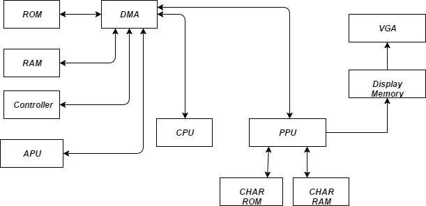
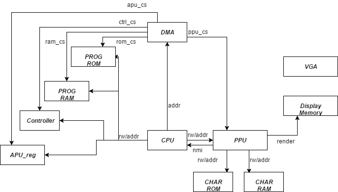
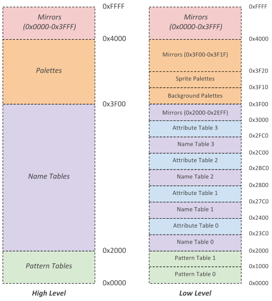
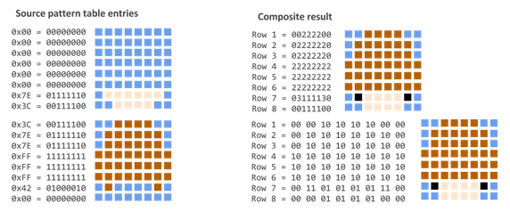
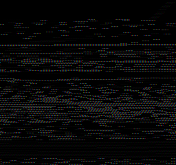
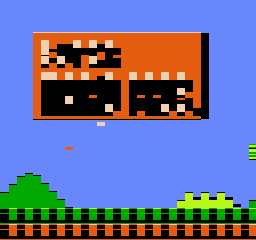
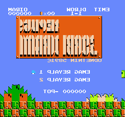
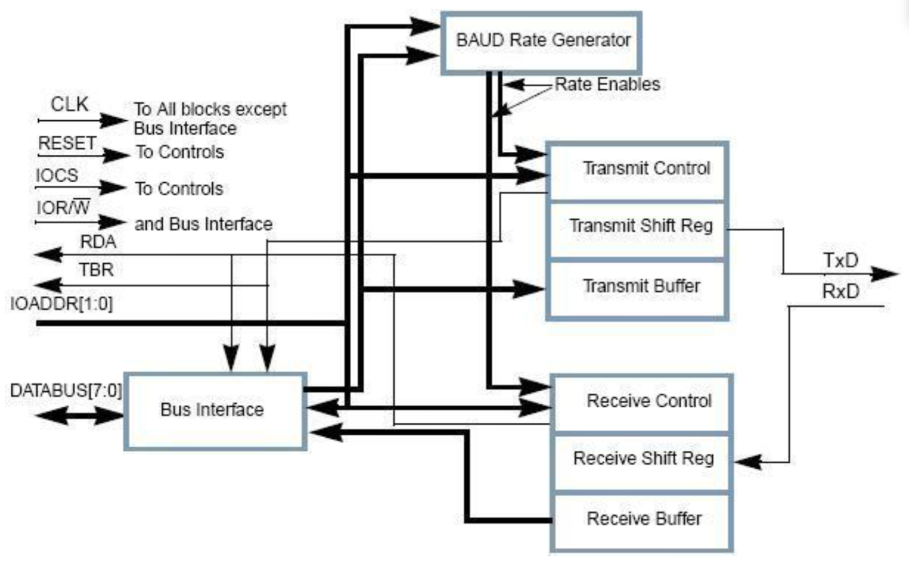
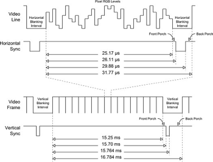
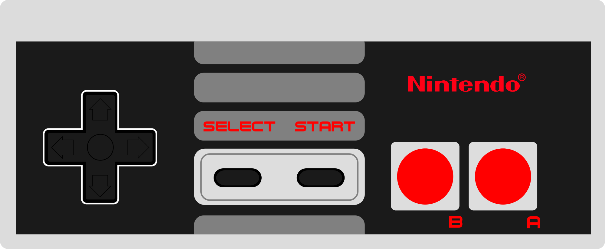

FPGA Implementation of the Nintendo Entertainment System (NES)

Four People Generating A Nintendo Entertainment System (FPGANES)

Eric Sullivan, Jonathan Ebert, Patrick Yang, Pavan Holla

Final Report 

University of Wisconsin-Madison

ECE 554

Spring 2017

<a href="#h.g5jrstas8bb9" class="c24">Introduction</a>        <a href="#h.g5jrstas8bb9" class="c24">6</a>

<a href="#h.1ayvkhk4vvmg" class="c24">Top Level Block Diagram</a>        <a href="#h.1ayvkhk4vvmg" class="c24">7</a>

<a href="#h.8r6j63kwrjxl" class="c24">Top level description</a>        <a href="#h.8r6j63kwrjxl" class="c24">7</a>

<a href="#h.a9ilbl8rkgkd" class="c24">Data Flow Diagram</a>        <a href="#h.a9ilbl8rkgkd" class="c24">8</a>

<a href="#h.m6jcsadip56s" class="c24">Control Flow Diagram</a>        <a href="#h.m6jcsadip56s" class="c24">8</a>

<a href="#h.rdm0fxe7s5y9" class="c24">CPU</a>        <a href="#h.rdm0fxe7s5y9" class="c24">9</a>

<a href="#h.eftj2rjo9s1h" class="c24">CPU Registers</a>        <a href="#h.eftj2rjo9s1h" class="c24">9</a>

<a href="#h.wvvuysbh6ili" class="c24">CPU ISA</a>        <a href="#h.wvvuysbh6ili" class="c24">9</a>

<a href="#h.9ie72e7qdon7" class="c24">CPU Addressing Modes</a>        <a href="#h.9ie72e7qdon7" class="c24">10</a>

<a href="#h.b7loafaij831" class="c24">CPU Interrupts</a>        <a href="#h.b7loafaij831" class="c24">10</a>

<a href="#h.q77927r8c49e" class="c24">CPU Opcode Matrix</a>        <a href="#h.q77927r8c49e" class="c24">10</a>

<a href="#h.ki2ushz1f0a3" class="c24">CPU Block Diagram</a>        <a href="#h.ki2ushz1f0a3" class="c24">13</a>

<a href="#h.er7yq56tef4v" class="c24">CPU Top Level Interface</a>        <a href="#h.er7yq56tef4v" class="c24">15</a>

<a href="#h.lomim8yvajg6" class="c24">CPU Instruction Decode Interface</a>        <a href="#h.lomim8yvajg6" class="c24">15</a>

<a href="#h.b3lc7rd7ackr" class="c24">CPU MEM Interface</a>        <a href="#h.b3lc7rd7ackr" class="c24">16</a>

<a href="#h.nexle64nrxxq" class="c24">CPU ALU Interface</a>        <a href="#h.nexle64nrxxq" class="c24">16</a>

<a href="#h.sprgfm6rx38x" class="c24">ALU Input Selector</a>        <a href="#h.sprgfm6rx38x" class="c24">17</a>

<a href="#h.5httww8vnv8g" class="c24">CPU Registers Interface</a>        <a href="#h.5httww8vnv8g" class="c24">17</a>

<a href="#h.eiifcf5tv1l9" class="c24">CPU Processor Control Interface</a>        <a href="#h.eiifcf5tv1l9" class="c24">18</a>

<a href="#h.3on9q42bqgrx" class="c24">CPU Enums</a>        <a href="#h.3on9q42bqgrx" class="c24">19</a>

<a href="#h.fb8snxockohd" class="c24">Picture Processing Unit</a>        <a href="#h.fb8snxockohd" class="c24">20</a>

<a href="#h.bvqrg858z31w" class="c24">PPU Top Level Schematic</a>        <a href="#h.bvqrg858z31w" class="c24">21</a>

<a href="#h.dkksbep8besq" class="c24">PPU Memory Map</a>        <a href="#h.dkksbep8besq" class="c24">22</a>

<a href="#h.pa3j41hpauwc" class="c24">PPU CHAROM</a>        <a href="#h.pa3j41hpauwc" class="c24">22</a>

<a href="#h.pg3as4rfwz9v" class="c24">PPU Rendering</a>        <a href="#h.pg3as4rfwz9v" class="c24">23</a>

<a href="#h.8bwwxukxxmnt" class="c24">PPU Memory Mapped Registers</a>        <a href="#h.8bwwxukxxmnt" class="c24">25</a>

<a href="#h.h50m30h4jbfm" class="c24">PPU Register Block Diagram</a>        <a href="#h.h50m30h4jbfm" class="c24">26</a>

<a href="#h.djradund7fk8" class="c24">PPU Register Descriptions</a>        <a href="#h.djradund7fk8" class="c24">26</a>

<a href="#h.qbi461d1fk95" class="c24">PPU Background Renderer</a>        <a href="#h.qbi461d1fk95" class="c24">28</a>

<a href="#h.kqe8ry35ghh" class="c24">PPU Background Renderer Diagram</a>        <a href="#h.kqe8ry35ghh" class="c24">29</a>

<a href="#h.z1adjveqdhdo" class="c24">PPU Sprite Renderer</a>        <a href="#h.z1adjveqdhdo" class="c24">30</a>

<a href="#h.ouavojij313q" class="c24">PPU Sprite Renderer Diagram</a>        <a href="#h.ouavojij313q" class="c24">32</a>

<a href="#h.ud4hcid0qc0t" class="c24">PPU Object Attribute Memory</a>        <a href="#h.ud4hcid0qc0t" class="c24">33</a>

<a href="#h.unbqcwik0ikz" class="c24">PPU Palette Memory</a>        <a href="#h.unbqcwik0ikz" class="c24">33</a>

<a href="#h.xlgt5p96mvki" class="c24">VRAM Interface</a>        <a href="#h.xlgt5p96mvki" class="c24">34</a>

<a href="#h.7oqgkdlshdds" class="c24">DMA</a>        <a href="#h.7oqgkdlshdds" class="c24">34</a>

<a href="#h.9f0tphgw8ifs" class="c24">PPU Testbench</a>        <a href="#h.9f0tphgw8ifs" class="c24">35</a>

<a href="#h.dgbwdleazq7q" class="c24">PPU Testbench PPM file format</a>        <a href="#h.dgbwdleazq7q" class="c24">36</a>

<a href="#h.8ijczpvs4ut5" class="c24">PPU Testbench Example Renderings</a>        <a href="#h.8ijczpvs4ut5" class="c24">37</a>

<a href="#h.7c1koopsou4c" class="c24">Memory Maps</a>        <a href="#h.7c1koopsou4c" class="c24">37</a>

<a href="#h.o4bj1b7uzlbc" class="c24">PPU ROM Memory Map</a>        <a href="#h.o4bj1b7uzlbc" class="c24">37</a>

<a href="#h.n5cypllda98c" class="c24">CPU ROM Memory Map</a>        <a href="#h.n5cypllda98c" class="c24">38</a>

<a href="#h.5cvhenp51lun" class="c24">Memory Mappers Interface</a>        <a href="#h.5cvhenp51lun" class="c24">39</a>

<a href="#h.bryqhbcn7knu" class="c24">APU</a>        <a href="#h.bryqhbcn7knu" class="c24">40</a>

<a href="#h.qk56hr19gphj" class="c24">APU Registers</a>        <a href="#h.qk56hr19gphj" class="c24">40</a>

<a href="#h.5fhzf7bk1zke" class="c24">Controllers (SPART)</a>        <a href="#h.5fhzf7bk1zke" class="c24">42</a>

<a href="#h.927n2dvl8df9" class="c24">Debug Modification</a>        <a href="#h.927n2dvl8df9" class="c24">42</a>

<a href="#h.917ivz4m4ziu" class="c24">Controller Registers</a>        <a href="#h.917ivz4m4ziu" class="c24">42</a>

<a href="#h.bnnsrcv0r4jw" class="c24">Controllers Wrapper</a>        <a href="#h.bnnsrcv0r4jw" class="c24">42</a>

<a href="#h.o12jcpl1v6h2" class="c24">Controller Wrapper Diagram</a>        <a href="#h.o12jcpl1v6h2" class="c24">43</a>

<a href="#h.b5ap3afv7f57" class="c24">Controller Wrapper Interface</a>        <a href="#h.b5ap3afv7f57" class="c24">43</a>

<a href="#h.ddzvq2rctlzt" class="c24">Controller</a>        <a href="#h.ddzvq2rctlzt" class="c24">44</a>

<a href="#h.ml0lp3awxz0e" class="c24">Controller Diagram</a>        <a href="#h.ml0lp3awxz0e" class="c24">44</a>

<a href="#h.8148udv35isa" class="c24">Controller Interface</a>        <a href="#h.8148udv35isa" class="c24">44</a>

<a href="#h.fna8vaz47pc1" class="c24">Special Purpose Asynchronous Receiver and Transmitter (SPART)</a>        <a href="#h.fna8vaz47pc1" class="c24">45</a>

<a href="#h.9khtivok6lhm" class="c24">SPART Diagram &amp; Interface</a>        <a href="#h.9khtivok6lhm" class="c24">45</a>

<a href="#h.fxadt5ql4b59" class="c24">Controller Driver</a>        <a href="#h.fxadt5ql4b59" class="c24">46</a>

<a href="#h.yma1hmwj1wcp" class="c24">Controller Driver State Machine</a>        <a href="#h.yma1hmwj1wcp" class="c24">46</a>

<a href="#h.xrfacxsmruiq" class="c24">VGA</a>        <a href="#h.xrfacxsmruiq" class="c24">47</a>

<a href="#h.7dmryvqi4l3b" class="c24">VGA Diagram</a>        <a href="#h.7dmryvqi4l3b" class="c24">47</a>

<a href="#h.7b41ivlnuec0" class="c24">VGA Interface</a>        <a href="#h.7b41ivlnuec0" class="c24">48</a>

<a href="#h.w1ger0jiy8bk" class="c24">VGA Clock Gen</a>        <a href="#h.w1ger0jiy8bk" class="c24">48</a>

<a href="#h.pw3svolg7ia" class="c24">VGA Timing Gen</a>        <a href="#h.pw3svolg7ia" class="c24">49</a>

<a href="#h.em4ktvbwfn8k" class="c24">VGA Display Plane</a>        <a href="#h.em4ktvbwfn8k" class="c24">49</a>

<a href="#h.68btkfb1o5ru" class="c24">VGA RAM Wrapper</a>        <a href="#h.68btkfb1o5ru" class="c24">50</a>

<a href="#h.1cvttmqqni8n" class="c24">VGA RAM Reader</a>        <a href="#h.1cvttmqqni8n" class="c24">50</a>

<a href="#h.zbj1aj20rigt" class="c24">Software</a>        <a href="#h.zbj1aj20rigt" class="c24">52</a>

<a href="#h.ik7f7bcto722" class="c24">Controller Simulator</a>        <a href="#h.ik7f7bcto722" class="c24">52</a>

<a href="#h.ev3eyvc4m806" class="c24">Controller Simulator State Machine</a>        <a href="#h.ev3eyvc4m806" class="c24">52</a>

<a href="#h.xqfqy7n0dj86" class="c24">Controller Simulator Output Packet Format</a>        <a href="#h.xqfqy7n0dj86" class="c24">52</a>

<a href="#h.wqujxd9v8i1y" class="c24">Controller Simulator GUI and Button Map</a>        <a href="#h.wqujxd9v8i1y" class="c24">53</a>

<a href="#h.t5xpa0jvlbyf" class="c24">Assembler</a>        <a href="#h.t5xpa0jvlbyf" class="c24">53</a>

<a href="#h.rp3i11uarg1" class="c24">Opcode Table</a>        <a href="#h.rp3i11uarg1" class="c24">54</a>

<a href="#h.fji30zo8qmh" class="c24">NES Assembly Formats</a>        <a href="#h.fji30zo8qmh" class="c24">56</a>

<a href="#h.1ftppbjfbpv9" class="c24">Invoking Assembler</a>        <a href="#h.1ftppbjfbpv9" class="c24">57</a>

<a href="#h.ekqczej5ygn6" class="c24">iNES ROM Converter</a>        <a href="#h.ekqczej5ygn6" class="c24">57</a>

<a href="#h.syub5w8xzigk" class="c24">Tic Tac Toe</a>        <a href="#h.syub5w8xzigk" class="c24">57</a>

<a href="#h.pefw11g7x04z" class="c24">Testing &amp; Debug</a>        <a href="#h.pefw11g7x04z" class="c24">58</a>

<a href="#h.i9v97r1jowjk" class="c24">Simulation</a>        <a href="#h.i9v97r1jowjk" class="c24">58</a>

<a href="#h.s28dapnuwz93" class="c24">Test</a>        <a href="#h.s28dapnuwz93" class="c24">58</a>

<a href="#h.mv68y8tja9lo" class="c24">Integrated Simulation</a>        <a href="#h.mv68y8tja9lo" class="c24">58</a>

<a href="#h.xldwn1zb9fzw" class="c24">Tracer</a>        <a href="#h.xldwn1zb9fzw" class="c24">58</a>

<a href="#h.6zhnn81o27us" class="c24">Results</a>        <a href="#h.6zhnn81o27us" class="c24">59</a>

<a href="#h.g7qfxmufg3ij" class="c24">Possible Improvements</a>        <a href="#h.g7qfxmufg3ij" class="c24">59</a>

<a href="#h.9xwc48i9bi3r" class="c24">References and Links</a>        <a href="#h.9xwc48i9bi3r" class="c24">59</a>

<a href="#h.vkgt15aadvpx" class="c24">Contributions</a>        <a href="#h.vkgt15aadvpx" class="c24">60</a>

<a href="#h.riv717lhxryl" class="c24">Eric Sullivan</a>        <a href="#h.riv717lhxryl" class="c24">60</a>

<a href="#h.fpooysc4oemr" class="c24">Patrick Yang</a>        <a href="#h.fpooysc4oemr" class="c24">60</a>

<a href="#h.7pjbrnhfuduw" class="c24">Pavan Holla</a>        <a href="#h.7pjbrnhfuduw" class="c24">60</a>

<a href="#h.jaedjh5lps0t" class="c24">Jonathan Ebert</a>        <a href="#h.jaedjh5lps0t" class="c24">60</a>

==============================

------------------------------------------------------------------------

==============================

1.  Introduction
    =========================

Following the video game crash in the early 1980s, Nintendo released their first video game console, the Nintendo Entertainment System (NES). Following a slow release and early recalls, the console began to gain momentum in a market that many thought had died out, and the NES is still appreciated by enthusiasts today. A majority of its early success was due to the relationship that Nintendo created with third-party software developers. Nintendo required that restricted developers from publishing games without a license distributed by Nintendo. This decision led to higher quality games and helped to sway the public opinion on video games, which had been plagued by poor games for other gaming consoles. 

Our motivation is to better understand how the NES worked from a hardware perspective, as the NES was an extremely advanced console when it was released in 1985 (USA). The NES has been recreated multiple times in software emulators, but has rarely been done in a hardware design language, which makes this a unique project.  Nintendo chose to use the 6502 processor, also used by Apple in the Apple II, and chose to include a picture processing unit to provide a memory efficient way to output video to the TV. Our goal was to recreate the CPU and PPU in hardware, so that we could run games that were run on the original console. In order to exactly recreate the original console, we needed to include memory mappers, an audio processing unit, a DMA unit, a VGA interface, and a way to use a controller for input. In addition, we wrote our own assembler and tic-tac-toe game to test our implementation.   The following sections will explain the microarchitecture of the NES. Much of the information was gleaned from nesdev.com, and from other online forums that reverse engineered the NES.

1.  Top Level Block Diagram
    =====================================================

<!-- -->

1.  Top level description
    ----------------------------------------------

Here is an overview of each module in our design. Our report has a section dedicated for each of these modules.

1.  PPU - The PPU(Picture Processing Unit) is responsible for rendering graphics on screen. It receives memory mapped accesses from the CPU, and renders graphics from memory, providing RGB values.
2.  CPU - Our CPU is a 6502 implementation. It is responsible for controlling all other modules in the NES. At boot, CPU starts reading programs at the address 0xFFFC.
3.  DMA - The DMA transfers chunks of data from CPU address space to PPU address space. It is faster than performing repeated Loads and Stores in the CPU.
4.  Display Memory and VGA - The PPU writes to the display memory, which is subsequently read out by the VGA module. The VGA module produces the hsync, vsync and RGB values that a monitor requires.
5.  Controller - A program runs on a host computer which transfers serial data to the FPGA. The protocol used by the controller is UART in our case
6.  APU - Generates audio in the NES. However, we did not implement this module.
7.  CHAR RAM/ RAM - Used by the CPU and PPU to store temporary data
8.  PROG ROM/ CHAR ROM - PROG ROM contains the software(instructions) that runs the game. CHAR ROM on the other hand contains mostly image data and graphics used in the game.

<!-- -->

1.  Data Flow Diagram
    ------------------------------------------

Figure 1: System level data flow diagram

1.   Control Flow Diagram
    ----------------------------------------------

Figure 2: System level control flow diagram.

1.  CPU
    =================================

CPU Registers
--------------------------------------

The CPU of the NES is the MOS 6502. It is an  accumulator plus index register machine. There are five primary registers on which operations are performed: 

1.  PC : Program Counter
2.  Accumulator(A) : Keeps track of results from ALU
3.  X : X index register
4.  Y  : Y index register
5.  Stack pointer
6.  Status Register : Negative, Overflow, Unused, Break, Decimal, Interrupt, Zero, Carry

-   Break means that the current interrupt is from software interrupt, BRK
-   Interrupt is high when maskable interrupts (IRQ) is to be ignored. Non-maskable interrupts (NMI) cannot be ignored.

There are 6 secondary registers:

1.  AD : Address Register

-   Stores where to jump to or where to get indirect access from.

1.  ADV : AD Value Register

-   Stores the value from indirect access by AD.

1.  BA : Base Address Register

-   Stores the base address before index calculation. After the calculation, the value is transferred to AD if needed.

1.  BAV : BA Value Register

-   Stores the value from indirect access by BA.

1.  IMM : Immediate Register

-   Stores the immediate value from the memory.

1.  Offset

-   Stores the offset value of branch from memory

CPU ISA
--------------------------------

The ISA may be classified into a few broad operations: 

-   Load into A,X,Y registers from memory
-   Perform arithmetic operation on A,X or Y
-   Move data from one register to another
-   Program control instructions like Jump and Branch
-   Stack operations
-   Complex instructions that read, modify and write back memory.

CPU Addressing Modes
---------------------------------------------

Additionally, there are thirteen addressing modes which these operations can use. They are

-   Accumulator – The data in the accumulator is used. 
-   Immediate - The byte in memory immediately following the instruction is used. 
-   Zero Page – The Nth byte in the first page of RAM is used where N is the byte in memory immediately following the instruction. 
-   Zero Page, X Index – The (N+X)th byte in the first page of RAM is used where N is the byte in memory immediately following the instruction and X is the contents of the X index register.
-   Zero Page, Y Index – Same as above but with the Y index register 
-   Absolute – The two bytes in memory following the instruction specify the absolute address of the byte of data to be used. 
-   Absolute, X Index - The two bytes in memory following the instruction specify the base address. The contents of the X index register are then added to the base address to obtain the address of the byte of data to be used. 
-   Absolute, Y Index – Same as above but with the Y index register 
-   Implied – Data is either not needed or the location of the data is implied by the instruction. 
-   Relative – The content of  sum of (the program counter and the byte in memory immediately following the instruction) is used. 
-   Absolute Indirect - The two bytes in memory following the instruction specify the absolute address of the two bytes that contain the absolute address of the byte of data to be used.
-   (Indirect, X) – A combination of Indirect Addressing and Indexed Addressing 
-   (Indirect), Y - A combination of Indirect Addressing and Indexed Addressing

CPU Interrupts
---------------------------------------

The 6502 supports three interrupts. The reset interrupt routine is called after a physical reset. The other two interrupts are the non\_maskable\_interrupt(NMI) and the general\_interrupt(IRQ). The general\_interrupt can be disabled by software whereas the others cannot. When interrupt occurs, the CPU finishes the current instruction then PC jumps to the specified interrupt vector then return when finished.  

CPU Opcode Matrix
------------------------------------------

The NES 6502 ISA is a CISC like ISA with 56 instructions. These 56 instructions can pair up with addressing modes to form various opcodes. The opcode is always 8 bits, however based on the addressing mode, upto 4 more memory location may need to be fetched.The memory is single cycle, i.e data\[7:0\] can be latched the cycle after address\[15:0\] is placed on the bus. The following tables summarize the instructions available and possible addressing modes:

Storage

LDA

Load A with M

LDX

Load X with M

LDY

Load Y with M

STA

Store A in M

STX

Store X in M

STY

Store Y in M

TAX

Transfer A to X

TAY

Transfer A to Y

TSX

Transfer Stack Pointer to X

TXA

Transfer X to A

TXS

Transfer X to Stack Pointer

TYA

Transfer Y to A

Arithmetic

ADC

Add M to A with Carry

DEC

Decrement M by One

DEX

Decrement X by One

DEY

Decrement Y by One

INC

Increment M by One

INX

Increment X by One

INY

Increment Y by One

SBC

Subtract M from A with Borrow

Bitwise

AND

AND M with A

ASL

Shift Left One Bit (M or A)

BIT

Test Bits in M with A

EOR

Exclusive-Or M with A

LSR

Shift Right One Bit (M or A)

ORA

OR M with A

ROL

Rotate One Bit Left (M or A)

ROR

Rotate One Bit Right (M or A)

Branch

BCC

Branch on Carry Clear

BCS

Branch on Carry Set

BEQ

Branch on Result Zero

BMI

Branch on Result Minus

BNE

Branch on Result not Zero

BPL

Branch on Result Plus

BVC

Branch on Overflow Clear

BVS

Branch on Overflow Set

Jump

JMP

Jump to Location

JSR

Jump to Location Save Return Address

RTI

Return from Interrupt

RTS

Return from Subroutine

Status Flags

CLC

Clear Carry Flag

CLD

Clear Decimal Mode

CLI

Clear interrupt Disable Bit

CLV

Clear Overflow Flag

CMP

Compare M and A

CPX

Compare M and X

CPY

Compare M and Y

SEC

Set Carry Flag

SED

Set Decimal Mode

SEI

Set Interrupt Disable Status

Stack

PHA

Push A on Stack

PHP

Push Processor Status on Stack

PLA

Pull A from Stack

PLP

Pull Processor Status from Stack

System

BRK

Force Break

NOP

No Operation

The specific opcode hex values are specified in the Assembler section.

For more information on the opcodes, please refer

<a href="https://www.google.com/url?q=http://www.6502.org/tutorials/6502opcodes.html&amp;sa=D&amp;ust=1494576242985000&amp;usg=AFQjCNEBeKqowaqwPg9HG_5qMJJCemVN9Q" class="c24">http://www.6502.org/tutorials/6502opcodes.html</a>

or 

<a href="https://www.google.com/url?q=http://www.thealmightyguru.com/Games/Hacking/Wiki/index.php/6502_Opcodes&amp;sa=D&amp;ust=1494576242986000&amp;usg=AFQjCNHWwLgjADTnuMa3o9CZ5cr83kwE8A" class="c24">http://www.thealmightyguru.com/Games/Hacking/Wiki/index.php/6502_Opcodes</a>

CPU Block Diagram
----------------------------------------------------------------------------------------------------------------------------------------------------------------------------------------------------------------------------------------------------------------------------------------------------------

<table>
<colgroup>
<col width="50%" />
<col width="50%" />
</colgroup>
<tbody>
<tr class="odd">
<td>
Block
</td>
<td>
Primary Function
</td>
</tr>
<tr class="even">
<td>
Decode
</td>
<td>
Decode the current instruction. Classifies the opcode into an instruction_type(arithmetic,ld etc) and addressing mode(immediate, indirect etc)
</td>
</tr>
<tr class="odd">
<td>
Processor Control
</td>
<td>
State machine that keeps track of current instruction stage, and generates signals to load registers.
</td>
</tr>
<tr class="even">
<td>
ALU
</td>
<td>
Performs ALU ops and handles Status Flags
</td>
</tr>
<tr class="odd">
<td>
Registers
</td>
<td>
Contains all registers. Register values change according to signals from processor control.
</td>
</tr>
<tr class="even">
<td>
Mem
</td>
<td>
Acts as the interface between CPU and memory. Mem block thinks it’s communicating with the memory but the DMA can reroute the communication to any other blocks like PPU, controller
</td>
</tr>
</tbody>
</table>

Instruction flow

The following table presents a high level overview of how each instruction is handled.

<table>
<colgroup>
<col width="33%" />
<col width="33%" />
<col width="33%" />
</colgroup>
<tbody>
<tr class="odd">
<td>
Cycle Number
</td>
<td>
Blocks 
</td>
<td>
Action
</td>
</tr>
<tr class="even">
<td>
0
</td>
<td>
Processor Control → Registers
</td>
<td>
Instruction Fetch 
</td>
</tr>
<tr class="odd">
<td>
1
</td>
<td>
Register →  Decode
</td>
<td>
Classify instruction and addressing mode
</td>
</tr>
<tr class="even">
<td>
1
</td>
<td>
Decode → Processor Control
</td>
<td>
Init state machine for instruction type and addressing mode
</td>
</tr>
<tr class="odd">
<td>
2-6
</td>
<td>
Processor Control → Registers
</td>
<td>
Populate scratch registers based on addressing mode.
</td>
</tr>
<tr class="even">
<td>
Last Cycle
</td>
<td>
Processor Control → ALU
</td>
<td>
Execute
</td>
</tr>
<tr class="odd">
<td>
Last Cycle
</td>
<td>
Processor Control → Registers
</td>
<td>
Instruction Fetch
</td>
</tr>
</tbody>
</table>

State Machines

Each {instruction\_type, addressing\_mode} triggers its own state machine. In brief, this state machine is responsible for signalling the Registers module to load/store addresses from memory or from the ALU. 

State machine spec for each instruction type and addressing mode can be found at <a href="https://www.google.com/url?q=https://docs.google.com/spreadsheets/d/16uGTSJEzrANUzr7dMmRNFAwA-_sEox-QsTjJSlt06lE/edit?usp%3Dsharing&amp;sa=D&amp;ust=1494576243018000&amp;usg=AFQjCNGRWTa2F9IkuDjlOnKv-jo9f3MhSQ" class="c24">https://docs.google.com/spreadsheets/d/16uGTSJEzrANUzr7dMmRNFAwA-_sEox-QsTjJSlt06lE/edit?usp=sharing</a>

Considering one of the simplest instructions ADC immediate,which takes two cycles, the state machine is as follows:

Instruction\_type=ARITHMETIC, addressing mode= IMMEDIATE

<table>
<colgroup>
<col width="33%" />
<col width="33%" />
<col width="33%" />
</colgroup>
<tbody>
<tr class="odd">
<td>
state=0
</td>
<td>
state=1
</td>
<td>
state=2
</td>
</tr>
<tr class="even">
<td>
ld_sel=LD_INSTR; //instr= memory_data

pc_sel=INC_PC; //pc++

next_state=state+1’b1

</td>
<td>
ld_sel=LD_IMM;

//imm=memory_data

pc_sel=INC_PC

next_state=state+1’b1
</td>
<td>
alu_ctrl=DO_OP_ADC // execute

src1_sel=SRC1_A

src2_sel=SRC2_IMM

dest_sel=DEST_A

ld_sel=LD_INSTR//fetch next instruction

pc_sel=INC_PC

next_state=1’b1
</td>
</tr>
</tbody>
</table>

All instructions are classified into one of 55 state machines in the cpu specification sheet. The 6502 can take variable time for a single instructions based on certain conditions(page\_cross, branch\_taken etc). These corner case state transitions are also taken care of by processor control.

CPU Top Level Interface
-------------------------------------------------------------

<table>
<colgroup>
<col width="25%" />
<col width="25%" />
<col width="25%" />
<col width="25%" />
</colgroup>
<tbody>
<tr class="odd">
<td>
Signal name
</td>
<td>
Signal Type
</td>
<td>
Source/Dest
</td>
<td>
Description
</td>
</tr>
<tr class="even">
<td>
clk
</td>
<td>
input
</td>
<td>

</td>
<td>
System clock
</td>
</tr>
<tr class="odd">
<td>
rst
</td>
<td>
input
</td>
<td>

</td>
<td>
System active high reset
</td>
</tr>
<tr class="even">
<td>
nmi
</td>
<td>
input
</td>
<td>
PPU
</td>
<td>
Non maskable interrupt from PPU. Executes BRK instruction in CPU
</td>
</tr>
<tr class="odd">
<td>
addr[15:0]
</td>
<td>
output
</td>
<td>
RAM
</td>
<td>
Address for R/W issued by CPU
</td>
</tr>
<tr class="even">
<td>
dout[7:0]
</td>
<td>
input/

output
</td>
<td>
RAM
</td>
<td>
Data from the RAM in case of reads and and to the RAM in case of writes
</td>
</tr>
<tr class="odd">
<td>
memory_read
</td>
<td>
output
</td>
<td>
RAM
</td>
<td>
read enable signal for RAM
</td>
</tr>
<tr class="even">
<td>
memory_write
</td>
<td>
output
</td>
<td>
RAM
</td>
<td>
write enable signal for RAM
</td>
</tr>
</tbody>
</table>

CPU Instruction Decode Interface
---------------------------------------------------------

The decode module is responsible for classifying the instruction into one of the addressing modes and an instruction type. It also generates the signal that the ALU would eventually use if the instruction passed through the ALU.        

<table>
<colgroup>
<col width="25%" />
<col width="25%" />
<col width="25%" />
<col width="25%" />
</colgroup>
<tbody>
<tr class="odd">
<td>
Signal name
</td>
<td>
Signal Type
</td>
<td>
Source/Dest
</td>
<td>
Description
</td>
</tr>
<tr class="even">
<td>
instruction_register
</td>
<td>
input
</td>
<td>
Registers
</td>
<td>
Opcode of the current instruction
</td>
</tr>
<tr class="odd">
<td>
nmi
</td>
<td>
input
</td>
<td>
cpu_top
</td>
<td>
Non maskable interrupt from PPU. Executes BRK instruction in CPU
</td>
</tr>
<tr class="even">
<td>
instruction_type
</td>
<td>
output
</td>
<td>
Processor Control
</td>
<td>
Type of instruction. Belongs to enum ITYPE.
</td>
</tr>
<tr class="odd">
<td>
addressing_mode
</td>
<td>
output
</td>
<td>
Processor Control
</td>
<td>
Addressing mode of the opcode in instruction_register. Belongs to enum AMODE.
</td>
</tr>
<tr class="even">
<td>
alu_sel
</td>
<td>
output
</td>
<td>
ALU
</td>
<td>
ALU operation expected to be performed by the opcode, eventually. Processor control chooses to use it at a cycle appropriate for the instruction. Belongs to enum DO_OP.
</td>
</tr>
</tbody>
</table>

CPU MEM Interface
------------------------------------------

The MEM module is the interface between memory and CPU. It provides appropriate address and read/write signal for the memory. Controlled by the select signals

<table>
<colgroup>
<col width="25%" />
<col width="25%" />
<col width="25%" />
<col width="25%" />
</colgroup>
<tbody>
<tr class="odd">
<td>
Signal name
</td>
<td>
Signal Type
</td>
<td>
Source/Dest
</td>
<td>
Description
</td>
</tr>
<tr class="even">
<td>
addr_sel
</td>
<td>
input
</td>
<td>
Processor Control
</td>
<td>
Selects which input to use as address to memory. Enum of ADDR
</td>
</tr>
<tr class="odd">
<td>
int_sel
</td>
<td>
input
</td>
<td>
Processor Control
</td>
<td>
Selects which interrupt address to jump to. Enum of INT_TYPE
</td>
</tr>
<tr class="even">
<td>
ld_sel,st_sel
</td>
<td>
input
</td>
<td>
Processor Control
</td>
<td>
Decides whether to read or write based on these signals
</td>
</tr>
<tr class="odd">
<td>
ad, ba, sp, irql, irqh, pc
</td>
<td>
input
</td>
<td>
Registers
</td>
<td>
Registers that are candidates of the address
</td>
</tr>
<tr class="even">
<td>
addr
</td>
<td>
output
</td>
<td>
Memory
</td>
<td>
Address of the memory to read/write
</td>
</tr>
<tr class="odd">
<td>
read,write
</td>
<td>
output
</td>
<td>
Memory
</td>
<td>
Selects whether Memory should read or write
</td>
</tr>
</tbody>
</table>

CPU ALU Interface
------------------------------------------

Performs arithmetic, logical operations and operations that involve status registers.

<table>
<colgroup>
<col width="25%" />
<col width="25%" />
<col width="25%" />
<col width="25%" />
</colgroup>
<tbody>
<tr class="odd">
<td>
Signal name
</td>
<td>
Signal Type
</td>
<td>
Source/Dest
</td>
<td>
Description
</td>
</tr>
<tr class="even">
<td>
in1, in2
</td>
<td>
input
</td>
<td>
ALU Input Selector
</td>
<td>
Inputs to the ALU operations selected by ALU Input module.
</td>
</tr>
<tr class="odd">
<td>
alu_sel
</td>
<td>
input
</td>
<td>
Processor Control
</td>
<td>
ALU operation expected to be performed by the opcode, eventually. Processor control chooses to use it at a cycle appropriate for the instruction. Belongs to enum DO_OP.
</td>
</tr>
<tr class="even">
<td>
clk, rst
</td>
<td>
input
</td>
<td>

</td>
<td>
System clock and active high reset
</td>
</tr>
<tr class="odd">
<td>
out
</td>
<td>
output
</td>
<td>
to all registers
</td>
<td>
Output of ALU operation. sent to all registers and registers decide whether to receive it or ignore it as its next value.
</td>
</tr>
<tr class="even">
<td>
n, z, v, c, b, d, i
</td>
<td>
output
</td>
<td>

</td>
<td>
Status Register
</td>
</tr>
</tbody>
</table>

### ALU Input Selector

Selects the input1 and input2 for the ALU

<table>
<colgroup>
<col width="25%" />
<col width="25%" />
<col width="25%" />
<col width="25%" />
</colgroup>
<tbody>
<tr class="odd">
<td>
Signal name
</td>
<td>
Signal Type
</td>
<td>
Source/Dest
</td>
<td>
Description
</td>
</tr>
<tr class="even">
<td>
src1_sel, src2_sel
</td>
<td>
input
</td>
<td>
Processor Control
</td>
<td>
Control signal that determines which sources to take in as inputs to ALU according to the instruction and addressing mode
</td>
</tr>
<tr class="odd">
<td>
a, bal, bah, adl, pcl, pch, imm, adv, x, bav, y, offset
</td>
<td>
input
</td>
<td>
Registers
</td>
<td>
Registers that are candidates to the input to ALU
</td>
</tr>
<tr class="even">
<td>
temp_status
</td>
<td>
input
</td>
<td>
ALU
</td>
<td>
Sometimes status information is required but we don’t want it to affect the status register. So we directly receive temp_status value from ALU
</td>
</tr>
<tr class="odd">
<td>
in1, in2
</td>
<td>
output
</td>
<td>
ALU
</td>
<td>
Selected input for the ALU
</td>
</tr>
</tbody>
</table>

CPU Registers Interface
------------------------------------------------

Holds all of the registers

<table>
<colgroup>
<col width="25%" />
<col width="25%" />
<col width="25%" />
<col width="25%" />
</colgroup>
<tbody>
<tr class="odd">
<td>
Signal name
</td>
<td>
Signal Type
</td>
<td>
Source/Dest
</td>
<td>
Description
</td>
</tr>
<tr class="even">
<td>
clk, rst
</td>
<td>
input
</td>
<td>

</td>
<td>
System clk and rst
</td>
</tr>
<tr class="odd">
<td>
dest_sel, pc_sel, sp_sel, ld_sel, st_sel
</td>
<td>
input
</td>
<td>
Processor Control
</td>
<td>
Selects which input to accept as new input. enum of DEST, PC, SP, LD, ST
</td>
</tr>
<tr class="even">
<td>
clr_adh, clr_bah
</td>
<td>
input
</td>
<td>
Processor Control
</td>
<td>
Clears the high byte of ad, ba
</td>
</tr>
<tr class="odd">
<td>
alu_out, next_status
</td>
<td>
input
</td>
<td>
ALU
</td>
<td>
Output from ALU and next status value. alu_out can be written to most of the registers
</td>
</tr>
<tr class="even">
<td>
data
</td>
<td>
inout
</td>
<td>
Memory
</td>
<td>
Datapath to Memory. Either receives or sends data according to ld_sel and st_sel.
</td>
</tr>
<tr class="odd">
<td>
a, x, y, ir, imm, adv, bav, offset, sp, pc, ad, ba, n, z, v, c, b, d, i, status
</td>
<td>
output
</td>
<td>

</td>
<td>
Register outputs that can be used by different modules
</td>
</tr>
</tbody>
</table>

CPU Processor Control Interface
--------------------------------------------------------

The processor control module maintains the current state that the instruction is in and decides the control signals for the next state. Once the instruction type and addressing modes are decoded, the processor control block becomes aware of the number of cycles the instruction will take. Thereafter, at each clock cycle it generates the required control signals.

<table>
<colgroup>
<col width="25%" />
<col width="25%" />
<col width="25%" />
<col width="25%" />
</colgroup>
<tbody>
<tr class="odd">
<td>
Signal name
</td>
<td>
Signal Type
</td>
<td>
Source/Dest
</td>
<td>
Description
</td>
</tr>
<tr class="even">
<td>
instruction_type
</td>
<td>
input
</td>
<td>
Decode
</td>
<td>
Type of instruction. Belongs to enum ITYPE.
</td>
</tr>
<tr class="odd">
<td>
addressing_mode
</td>
<td>
input
</td>
<td>
Decode
</td>
<td>
Addressing mode of the opcode in instruction_register. Belongs to enum AMODE.
</td>
</tr>
<tr class="even">
<td>
alu_ctrl
</td>
<td>
input
</td>
<td>
Decode
</td>
<td>
ALU operation expected to be performed by the opcode, eventually. Processor control chooses to use it at a cycle appropriate for the instruction. Belongs to enum DO_OP.
</td>
</tr>
<tr class="odd">
<td>
reset_adh
</td>
<td>
output
</td>
<td>
Registers
</td>
<td>
Resets ADH register
</td>
</tr>
<tr class="even">
<td>
reset_bah
</td>
<td>
output
</td>
<td>
Registers
</td>
<td>
Resets BAH register
</td>
</tr>
<tr class="odd">
<td>
set_b
</td>
<td>
output
</td>
<td>
Registers
</td>
<td>
Sets the B flag
</td>
</tr>
<tr class="even">
<td>
addr_sel
</td>
<td>
output
</td>
<td>
Registers
</td>
<td>
Selects the value that needs to be set on the address bus. Belongs to enum ADDR
</td>
</tr>
<tr class="odd">
<td>
alu_sel
</td>
<td>
output
</td>
<td>
ALU
</td>
<td>
Selects the operation to be performed by the ALU in the current cycle. Belongs to enum DO_OP
</td>
</tr>
<tr class="even">
<td>
dest_sel
</td>
<td>
output
</td>
<td>
Registers
</td>
<td>
Selects the register that receives the value from ALU output.Belongs to enum DEST
</td>
</tr>
<tr class="odd">
<td>
ld_sel
</td>
<td>
output
</td>
<td>
Registers
</td>
<td>
Selects the register that will receive the value from Memory Bus. Belongs to enum LD
</td>
</tr>
<tr class="even">
<td>
pc_sel
</td>
<td>
output
</td>
<td>
Registers
</td>
<td>
Selects the value that the PC will take next cycle. Belongs to enum PC
</td>
</tr>
<tr class="odd">
<td>
sp_sel
</td>
<td>
output
</td>
<td>
Registers
</td>
<td>
Selects the value that the SP  will take next cycle. Belongs to enum SP
</td>
</tr>
<tr class="even">
<td>
src1_sel
</td>
<td>
output
</td>
<td>
ALU
</td>
<td>
Selects src1 for ALU. Belongs to enum SRC1
</td>
</tr>
<tr class="odd">
<td>
src2_sel
</td>
<td>
output
</td>
<td>
ALU
</td>
<td>
Selects src2 for ALU. Belongs to enum SRC2
</td>
</tr>
<tr class="even">
<td>
st_sel
</td>
<td>
output
</td>
<td>
Registers
</td>
<td>
Selects the register whose value will be placed on dout. Belongs to enum ST
</td>
</tr>
</tbody>
</table>

CPU Enums
----------------------------------

<table>
<colgroup>
<col width="50%" />
<col width="50%" />
</colgroup>
<tbody>
<tr class="odd">
<td>
Enum name
</td>
<td>
Legal Values
</td>
</tr>
<tr class="even">
<td>
ITYPE
</td>
<td>
ARITHMETIC,BRANCH,BREAK,CMPLDX,CMPLDY,INTERRUPT,JSR,JUMP,OTHER,PULL,PUSH,RMW,RTI,RTS,STA,STX,STY
</td>
</tr>
<tr class="odd">
<td>
AMODE
</td>
<td>
ABSOLUTE,ABSOLUTE_INDEX,ABSOLUTE_INDEX_Y,ACCUMULATOR,IMMEDIATE,IMPLIED,INDIRECT,INDIRECT_X,INDIRECT_Y,RELATIVE,SPECIAL,ZEROPAGE,ZEROPAGE_INDEX,ZEROPAGE_INDEX_Y
</td>
</tr>
<tr class="even">
<td>
DO_OP
</td>
<td>
DO_OP_ADD,DO_OP_SUB,DO_OP_AND,DO_OP_OR,DO_OP_XOR,DO_OP_ASL,DO_OP_LSR,DO_OP_ROL,DO_OP_ROR,DO_OP_SRC2DO_OP_CLR_C,DO_OP_CLR_I,DO_OP_CLR_V,DO_OP_SET_C,DO_OP_SET_I,DO_OP_SET_V
</td>
</tr>
<tr class="odd">
<td>
ADDR
</td>
<td>
ADDR_AD,ADDR_PC,ADDR_BA,ADDR_SP,ADDR_IRQL,ADDR_IRQH
</td>
</tr>
<tr class="even">
<td>
LD
</td>
<td>
LD_INSTR,LD_ADL,LD_ADH,LD_BAL,LD_BAH,LD_IMM,LD_OFFSET,LD_ADV,LD_BAV,LD_PCL,LD_PCH
</td>
</tr>
<tr class="odd">
<td>
SRC1
</td>
<td>
SRC1_A,SRC1_BAL,SRC1_BAH,SRC1_ADL,SRC1_PCL,SRC1_PCH,SRC1_BAV,SRC1_1
</td>
</tr>
<tr class="even">
<td>
SRC2
</td>
<td>
SRC2_DC,SRC2_IMM,SRC2_ADV,SRC2_X,SRC2_BAV,SRC2_C,SRC2_1,SRC2_Y,SRC2_OFFSET
</td>
</tr>
<tr class="odd">
<td>
DEST
</td>
<td>
DEST_BAL,DEST_BAH,DEST_ADL,DEST_A,DEST_X,DEST_Y,DEST_PCL,DEST_PCH,DEST_NONE
</td>
</tr>
<tr class="even">
<td>
PC
</td>
<td>
AD_P_TO_PC,INC_PC,KEEP_PC
</td>
</tr>
<tr class="odd">
<td>
SP
</td>
<td>
INC_SP,DEC_SP
</td>
</tr>
</tbody>
</table>

1.  Picture Processing Unit
    =====================================================

The NES picture processing unit or PPU is the unit responsible for handling all of the console's graphical workloads. Obviously this is useful to the CPU because it offloads the highly intensive task of rendering a frame. This means the CPU can spend more time performing the game logic. 

The PPU renders a frame by reading in scene data from various memories the PPU has access to such as VRAM, the game cart, and object attribute memory and then outputting an NTSC compliant 256x240 video signal at 60 Hz. The PPU was a special custom designed IC for Nintendo, so no other devices use this specific chip. It operates at a clock speed of 5.32 MHz making it three times faster than the NES CPU. This is one of the areas of difficulty in creating the PPU because it is easy to get the CPU and PPU clock domains out of sync.

PPU Top Level Schematic
------------------------------------------------

6502: The CPU used in the NES. Communicates with the PPU through simple load/store instructions. This works because the PPU registers are memory mapped into the CPU's address space.

Address Decoder: The address decoder is responsible for selecting the chip select of the device the CPU wants to talk to. In the case of the PPU the address decoder will activate if from addresses \[0x2000, 0x2007\].

VRAM: The PPU video memory contains the data needed to render the scene, specifically it holds the name tables. VRAM is 2 Kb in size and depending on how the PPU VRAM address lines are configured, different mirroring schemes are possible. 

Game Cart: The game cart has a special ROM on it called the character ROM, or char ROM for short. the char ROM contains the sprite and background tile pattern data. These are sometimes referred to as the pattern tables. 

PPU Registers: These registers allow the CPU to modify the state of the PPU. It maintains all of the control signals that are sent to both the background and sprite renderers.

Background Renderer: Responsible for drawing the background data for a scene. 

Sprite Renderer: Responsible for drawing the sprite data for a scene, and maintaining object attribute memory.

Object Attribute Memory: Holds all of the data needed to know how to render a sprite. OAM is 256 bytes in size and each sprite utilizes 4 bytes of data. This means the PPU can support 64 sprites.

Pixel Priority: During the visible pixel section of rendering, both the background and sprite renderers produce a single pixel each clock cycle. The pixel priority module looks at the priority values and color for each pixel and decides which one to draw to the screen. 

VGA Interface: This is where all of the frame data is kept in a frame buffer. This data is then upscaled to 640x480 when it goes out to the monitor.

PPU Memory Map
---------------------------------------

The PPU memory map is broken up into three distinct regions, the pattern tables, name tables, and palettes. Each of these regions holds data the PPU need to obtain to render a given scanline. The functionality of each part is described in the PPU Rendering section.

PPU CHAROM
-----------------------------------

-   ROM from the cartridge is broken in two sections

<!-- -->

-   Program ROM

<!-- -->

-   Contains program code for the 6502
-   Is mapped into the CPU address space by the mapper

<!-- -->

-   Character ROM 

<!-- -->

-   Contains sprite and background data for the PPU
-   Is mapped into the PPU address space by the mapper

PPU Rendering
--------------------------------------

-   Pattern Tables

<!-- -->

-   $0000-$2000 in VRAM

<!-- -->

-   Pattern Table 0 ($0000-$0FFF)
-   Pattern Table 1 ($1000-$2000)
-   The program selects which one of these contains sprites and backgrounds
-   Each pattern table is 16 bytes long and represents 1 8x8 pixel tile

<!-- -->

-   Each 8x1 row is 2 bytes long
-   Each bit in the byte represents a pixel and the corresponding bit for each byte is combined to create a 2 bit color.

<!-- -->

-   Color\_pixel = {byte2\[0\], byte1\[0\]}

<!-- -->

-   So there can only be 4 colors in any given tile
-   Rightmost bit is leftmost pixel

<!-- -->

-   Any pattern that has a value of 0 is transparent i.e. the background color

-   Name Tables

<!-- -->

-   $2000-$2FFF in VRAM with $3000-$3EFF as a mirror
-   Laid out in memory in 32x30 fashion

<!-- -->

-   Think of as a 2d array where each element specifies a tile in the pattern table.
-   This results in a resolution of 256x240

<!-- -->

-   Although the PPU supports 4 name tables the NES only supplied enough VRAM for 2 this results in 2 of the 4 name tables being mirror

<!-- -->

-   Vertically = horizontal movement
-   Horizontally = vertical movement

<!-- -->

-   Each entry in the name table refers to one pattern table and is one byte. Since there are 32x30=960 entries each name table requires 960 bytes of space the left over 64 bytes are used for attribute tables
-   Attribute tables

<!-- -->

-   1 byte entries that contains the palette assignment for a 2x2 grid of tiles

-   Sprites

<!-- -->

-   Just like backgrounds sprite tile data is contained in one of the pattern tables
-   But unlike backgrounds sprite information is not contained in name tables but in a special reserved 256 byte RAM called the object attribute memory (OAM)

<!-- -->

-   Object Attribute Memory

<!-- -->

-   256 bytes of dedicated RAM
-   Each object is allocated 4 bytes of OAM so we can store data about 64 sprites at once
-   Each object has the following information stored in OAM

<!-- -->

-   X Coordinate
-   Y Coordinate
-   Pattern Table Index
-   Palette Assignment
-   Horizontal/Vertical Flip

<!-- -->

-   Palette Table

<!-- -->

-   Located at $3F00-$3F20

<!-- -->

-   $3F00-$3F0F is background palettes
-   $3F10-$3F1F is sprite palettes

<!-- -->

-   Mirrored all the way to $4000
-   Each color takes one byte
-   Every background tile and sprite needs a color palette.
-   When the background or sprite is being rendered the the color for a specific table is looked up in the correct palette and sent to the draw select mux.

<!-- -->

-   Rendering is broken into two parts which are done for each horizontal scanline

<!-- -->

-   Background Rendering

<!-- -->

-   The background enable register ($2001) controls if the default background color is rendered ($2001) or if background data from the background renderer.
-   The background data is obtained for every pixel.

<!-- -->

-   Sprite Rendering

<!-- -->

-   The sprite renderer has room for 8 unique sprites on each scanline.
-   For each scanline the renderer looks through the OAM for sprites that need to be drawn on the scanline. If this is the case the sprite is loaded into the scanline local sprites

<!-- -->

-   If this number exceeds 8 a flag is set and the behavior is undefined.

<!-- -->

-   If a sprite should be drawn for a pixel instead of the background the sprite renderer sets the sprite priority line to a mux that decides what to send to the screen and the mux selects the sprite color data.

PPU Memory Mapped Registers
----------------------------------------------------

The PPU register interface exists so the CPU can modify and fetch the state elements of the PPU. These state elements include registers that set control signals, VRAM, object attribute memory, and palettes. These state elements then determine how the background and sprite renderers will draw the scene. The PPU register module also contains the pixel mux and palette memory which are used to determine what pixel data to send to the VGA module.

<table>
<colgroup>
<col width="25%" />
<col width="25%" />
<col width="25%" />
<col width="25%" />
</colgroup>
<tbody>
<tr class="odd">
<td>
Signal name
</td>
<td>
Signal Type
</td>
<td>
Source/Dest
</td>
<td>
Description
</td>
</tr>
<tr class="even">
<td>
clk
</td>
<td>
input
</td>
<td>

</td>
<td>
System clock
</td>
</tr>
<tr class="odd">
<td>
rst_n
</td>
<td>
input
</td>
<td>

</td>
<td>
System active low reset
</td>
</tr>
<tr class="even">
<td>
data[7:0]
</td>
<td>
inout
</td>
<td>
CPU
</td>
<td>
Bi directional data bus between the CPU/PPU
</td>
</tr>
<tr class="odd">
<td>
address[2:0]
</td>
<td>
input
</td>
<td>
CPU
</td>
<td>
Register select
</td>
</tr>
<tr class="even">
<td>
rw
</td>
<td>
input
</td>
<td>
CPU
</td>
<td>
CPU read/write select
</td>
</tr>
<tr class="odd">
<td>
cs_in
</td>
<td>
input
</td>
<td>
CPU
</td>
<td>
PPU chip select
</td>
</tr>
<tr class="even">
<td>
irq
</td>
<td>
output
</td>
<td>
CPU
</td>
<td>
Signal PPU asserts to trigger CPU NMI
</td>
</tr>
<tr class="odd">
<td>
pixel_data[7:0]
</td>
<td>
output
</td>
<td>
VGA
</td>
<td>
RGB pixel data to be sent to the display
</td>
</tr>
<tr class="even">
<td>
vram_addr_out[13:0]
</td>
<td>
output
</td>
<td>
VRAM
</td>
<td>
VRAM address to read/write from
</td>
</tr>
<tr class="odd">
<td>
vram_rw_sel
</td>
<td>
output
</td>
<td>
VRAM
</td>
<td>
Determines if the current vram operation is a read or write
</td>
</tr>
<tr class="even">
<td>
vram_data_out[7:0]
</td>
<td>
output
</td>
<td>
VRAM
</td>
<td>
Data to write to VRAM
</td>
</tr>
<tr class="odd">
<td>
frame_end
</td>
<td>
output
</td>
<td>
VGA
</td>
<td>
Signals the VGA interface that this is the end of a frame
</td>
</tr>
<tr class="even">
<td>
frame_start
</td>
<td>
output
</td>
<td>
VGA
</td>
<td>
Signals the VGA interface that a frame is starting to keep the PPU and VGA in sync
</td>
</tr>
<tr class="odd">
<td>
rendering
</td>
<td>
output
</td>
<td>
VGA
</td>
<td>
Signals the VGA interface that pixel data output is valid
</td>
</tr>
</tbody>
</table>

PPU Register Block Diagram
---------------------------------------------------

PPU Register Descriptions
--------------------------------------------------

-   Control registers are mapped into the CPUs address space ($2000 - $2007)
-   The registers are repeated every eight bytes until address $3FF
-   PPUCTRL\[7:0\] ($2000) WRITE

<!-- -->

-   \[1:0\]: Base nametable address which is loaded at the start of a frame

<!-- -->

-   0: $2000
-   1: $2400
-   2: $2800
-   3: $2C00

<!-- -->

-   \[2\]: VRAM address increment per CPU read/write of PPUDATA

<!-- -->

-   0: Add 1 going across
-   1: Add 32 going down

<!-- -->

-   \[3\]: Sprite pattern table for 8x8 sprites

<!-- -->

-   0: $0000
-   1: $1000
-   Ignored in 8x16 sprite mode

<!-- -->

-   \[4\]: Background pattern table address

<!-- -->

-   0: $0000
-   1: $1000

<!-- -->

-   \[5\]: Sprite size

<!-- -->

-   0: 8x8
-   1: 8x16

<!-- -->

-   \[6\]: PPU master/slave select

<!-- -->

-   0: Read backdrop from EXT pins
-   1: Output color on EXT pins

<!-- -->

-   \[7\]: Generate NMI interrupt at the start of vertical blanking interval

<!-- -->

-   0: off
-   1: on

<!-- -->

-   PPUMASK\[7:0\] ($2001) WRITE

<!-- -->

-   \[0\]: Use grayscale image

<!-- -->

-   0: Normal color
-   1: Grayscale

<!-- -->

-   \[1\]: Show left 8 pixels of background

<!-- -->

-   0: Hide
-   1: Show background in leftmost 8 pixels of screen

<!-- -->

-   \[2\]: Show left 8 piexels of sprites

<!-- -->

-   0: Hide
-   1: Show sprites in leftmost 8 pixels of screen

<!-- -->

-   \[3\]: Render the background

<!-- -->

-   0: Don’t show background
-   1: Show background

<!-- -->

-   \[4\]: Render the sprites

<!-- -->

-   0: Don’t show sprites
-   1: Show sprites

<!-- -->

-   \[5\]: Emphasize red
-   \[6\]: Emphasize green
-   \[7\]: Emphasize blue

<!-- -->

-   PPUSTATUS\[7:0\] ($2002) READ

<!-- -->

-   \[4:0\]: Nothing?
-   \[5\]: Set for sprite overflow which is when more than 8 sprites exist in one scanline (Is actually more complicated than this to do a hardware bug)
-   \[6\]: Sprite 0 hit. This bit gets set when a non zero part of sprite zero overlaps a non zero background pixel
-   \[7\]: Vertical blank status register

<!-- -->

-   0: Not in vertical blank
-   1: Currently in vertical blank

<!-- -->

-   OAMADDR\[7:0\] ($2003) WRITE

<!-- -->

-   Address of the object attribute memory the program wants to access

<!-- -->

-   OAMDATA\[7:0\] ($2004) READ/WRITE

<!-- -->

-   The CPU can read/write this register to read or write to the PPUs object attribute memory. The address should be specified by writing the OAMADDR register beforehand. Each write will increment the address by one, but a read will not modify the address

<!-- -->

-   PPUSCROLL\[7:0\] ($2005) WRITE

<!-- -->

-   Tells the PPU what pixel of the nametable selected in PPUCTRL should be in the top left hand corner of the screen

<!-- -->

-   PPUADDR\[7:0\] ($2006) WRITE

<!-- -->

-   Address the CPU wants to write to VRAM before writing a read of PPUSTATUS is required and then two bytes are written in first the high byte then the low byte

<!-- -->

-   PPUDATA\[7:0\] ($2007) READ/WRITE

<!-- -->

-   Writes/Reads data from VRAM for the CPU. The value in PPUADDR is then incremented by the value specified in PPUCTRL

<!-- -->

-   OAMDMA\[7:0\] ($4014) WRITE

<!-- -->

-   A write of $XX to this register will result in the CPU memory page at $XX00-$XXFF being written into the PPU object attribute memory

PPU Background Renderer
------------------------------------------------

The background renderer is responsible for rendering the background for each frame that is output to the VGA interface. It does this by prefetching the data for two tiles at the end of the previous scanline. And then begins to continuously fetch tile data for every pixel of the visible frame. This allows the background renderer to produce a steady flow of output pixels despite the fact it takes 8 cycles to fetch 8 pixels of a scanline.

<table>
<colgroup>
<col width="25%" />
<col width="25%" />
<col width="25%" />
<col width="25%" />
</colgroup>
<tbody>
<tr class="odd">
<td>
Signal name
</td>
<td>
Signal Type
</td>
<td>
Source/Dest
</td>
<td>
Description
</td>
</tr>
<tr class="even">
<td>
clk
</td>
<td>
input
</td>
<td>

</td>
<td>
System clock
</td>
</tr>
<tr class="odd">
<td>
rst_n
</td>
<td>
input
</td>
<td>

</td>
<td>
System active low reset
</td>
</tr>
<tr class="even">
<td>
bg_render_en
</td>
<td>
input
</td>
<td>
PPU Register
</td>
<td>
Background render enable
</td>
</tr>
<tr class="odd">
<td>
x_pos[9:0]
</td>
<td>
input
</td>
<td>
PPU Register
</td>
<td>
The current pixel for the active scanline
</td>
</tr>
<tr class="even">
<td>
y_pos[9:0]
</td>
<td>
input
</td>
<td>
PPU Register
</td>
<td>
The current scanline being rendered
</td>
</tr>
<tr class="odd">
<td>
vram_data_in[7:0]
</td>
<td>
input
</td>
<td>
PPU Register
</td>
<td>
The current data that has been read in from VRAM
</td>
</tr>
<tr class="even">
<td>
bg_pt_sel
</td>
<td>
input
</td>
<td>
PPU Register
</td>
<td>
Selects the location of the background renderer pattern table
</td>
</tr>
<tr class="odd">
<td>
show_bg_left_col
</td>
<td>
input
</td>
<td>
PPU Register
</td>
<td>
Determines if the background for the leftmost 8 pixels of each scanline will be drawn
</td>
</tr>
<tr class="even">
<td>
fine_x_scroll[2:0]
</td>
<td>
input
</td>
<td>
PPU Register
</td>
<td>
Selects the pixel drawn on the left hand side of the screen
</td>
</tr>
<tr class="odd">
<td>
coarse_x_scroll[4:0]
</td>
<td>
input
</td>
<td>
PPU Register
</td>
<td>
Selects the tile to start rendering from in the x direction
</td>
</tr>
<tr class="even">
<td>
fine_y_scroll[2:0]
</td>
<td>
input
</td>
<td>
PPU Register
</td>
<td>
Selects the pixel drawn on the top of the screen
</td>
</tr>
<tr class="odd">
<td>
coarse_y_scroll[4:0]
</td>
<td>
input
</td>
<td>
PPU Register
</td>
<td>
Selects the tile to start rendering from in the y direction
</td>
</tr>
<tr class="even">
<td>
nametable_sel[1:0]
</td>
<td>
input
</td>
<td>
PPU Register
</td>
<td>
Selects the nametable to start rendering from
</td>
</tr>
<tr class="odd">
<td>
update_loopy_v
</td>
<td>
input
</td>
<td>
PPU Register
</td>
<td>
Signal to update the temporary vram address
</td>
</tr>
<tr class="even">
<td>
cpu_loopy_v_inc
</td>
<td>
input
</td>
<td>
PPU Register
</td>
<td>
Signal to increment the temporary vram address by the increment amount
</td>
</tr>
<tr class="odd">
<td>
cpu_loopy_v_inc_amt
</td>
<td>
input
</td>
<td>
PPU Register
</td>
<td>
If this signal is set increment the temp vram address by 32 on cpu_loopy_v_inc, and increment by 1 if it is not set on cpu_loopy_v_inc
</td>
</tr>
<tr class="even">
<td>
vblank_out
</td>
<td>
output
</td>
<td>
PPU Register
</td>
<td>
Determines it the PPU is in vertical blank
</td>
</tr>
<tr class="odd">
<td>
bg_rendering_out
</td>
<td>
output
</td>
<td>
PPU Register
</td>
<td>
Determines if the bg renderer is requesting vram reads
</td>
</tr>
<tr class="even">
<td>
bg_pal_sel[3:0]
</td>
<td>
output
</td>
<td>
Pixel Mux
</td>
<td>
Selects the palette for the background pixel
</td>
</tr>
<tr class="odd">
<td>
loopy_v_out[14:0]
</td>
<td>
output
</td>
<td>
PPU Register
</td>
<td>
The temporary vram address register for vram reads/writes
</td>
</tr>
<tr class="even">
<td>
vram_addr_out[13:0]
</td>
<td>
output
</td>
<td>
VRAM
</td>
<td>
The VRAM address the sprite renderer wants to read from
</td>
</tr>
</tbody>
</table>

PPU Background Renderer Diagram
--------------------------------------------------------

VRAM: The background renderer reads from two of the three major areas of address space available to the PPU, the pattern tables, and the name tables. First the background renderer needs the name table byte for a given tile to know which tile to draw in the background. Once it has this information is need the pattern to know how to draw the background tile.

PPU Register Interface: All background rendering VRAM reads are performed through the PPU register interface. This allows for vram address bus arbitration between the background renderer, sprite renderer, and the cpu.

Scrolling Register: The scrolling register is responsible for keeping track of what tile is currently being drawn to the screen. 

Scrolling Update Logic: Every time the data for a background tile is successfully fetched the scrolling register needs to be updated. Most of the time it is a simple increment, but more care has to be taken when the next tile falls in another name table. This logic allows the scrolling register to correctly update to be able to smoothly jump between name tables while rendering. 

Background Renderer State Machine: The background renderer state machine is responsible for sending the correct control signals to all of the other modules as the background is rendering. 

Background Shift Registers: These registers shift out the pixel data to be rendered on every clock cycle. They also implement the logic that makes fine one pixel scrolling possible by changing what index of the shift registers is the one being shifted out each cycle.

Pixel Priority Mux: Since both the sprite renderer and background renderer output one pixel every clock cycle during the visible part of the frame, there needs to be some logic to pick between the two pixels that are output. The pixel priority mux does this based on the priority of the sprite pixel, and the color of both the sprite pixel and background pixel.

PPU Sprite Renderer
--------------------------------------------

The PPU sprite renderer is used to render all of the sprite data for each scanline. The way the hardware was designed it only allows for 64 sprites to kept in object attribute memory at once. There are only 8 spots available to store the sprite data for each scanline so only 8 sprites can be rendered for each scanline. Sprite data in OAM is evaluated for the next scanline while the background renderer is mastering the VRAM bus. When rendering reaches horizontal blank the sprite renderer fetches the pattern data for all of the sprites to be rendered on the next scanline and places the data in the sprite shift registers. The sprite x position is also loaded into a down counter which determines when to make the sprite active and shift out the pattern data on the next scanline.

<table>
<colgroup>
<col width="25%" />
<col width="25%" />
<col width="25%" />
<col width="25%" />
</colgroup>
<tbody>
<tr class="odd">
<td>
Signal name
</td>
<td>
Signal Type
</td>
<td>
Source/Dest
</td>
<td>
Description
</td>
</tr>
<tr class="even">
<td>
clk
</td>
<td>
input
</td>
<td>

</td>
<td>
System clock
</td>
</tr>
<tr class="odd">
<td>
rst_n
</td>
<td>
input
</td>
<td>

</td>
<td>
System active low reset
</td>
</tr>
<tr class="even">
<td>
spr_render_en
</td>
<td>
input
</td>
<td>
PPU Register
</td>
<td>
Sprite renderer enable signal
</td>
</tr>
<tr class="odd">
<td>
x_pos[9:0]
</td>
<td>
input
</td>
<td>
PPU Register
</td>
<td>
The current pixel for the active scanline
</td>
</tr>
<tr class="even">
<td>
y_pos[9:0]
</td>
<td>
input
</td>
<td>
PPU Register
</td>
<td>
The current scanline being rendered
</td>
</tr>
<tr class="odd">
<td>
spr_addr_in[7:0]
</td>
<td>
input
</td>
<td>
PPU Register
</td>
<td>
The current OAM address being read/written
</td>
</tr>
<tr class="even">
<td>
spr_data_in[7:0]
</td>
<td>
inout
</td>
<td>
PPU Register
</td>
<td>
The current data being read/written from OAM
</td>
</tr>
<tr class="odd">
<td>
vram_data_in[7:0]
</td>
<td>
input
</td>
<td>
VRAM
</td>
<td>
The data the sprite renderer requested from VRAM
</td>
</tr>
<tr class="even">
<td>
cpu_oam_rw
</td>
<td>
input
</td>
<td>
PPU Register
</td>
<td>
Selects if OAM is being read from or written to from the CPU
</td>
</tr>
<tr class="odd">
<td>
cpu_oam_req
</td>
<td>
input
</td>
<td>
PPU Register
</td>
<td>
Signals the CPU wants to read/write OAM
</td>
</tr>
<tr class="even">
<td>
spr_pt_sel
</td>
<td>
input
</td>
<td>
PPU Register
</td>
<td>
Determines the PPU pattern table address in VRAM
</td>
</tr>
<tr class="odd">
<td>
spr_size_sel
</td>
<td>
input
</td>
<td>
PPU Register
</td>
<td>
Determines the size of the sprites to be drawn
</td>
</tr>
<tr class="even">
<td>
show_spr_left_col
</td>
<td>
input
</td>
<td>
PPU Register
</td>
<td>
Determines if sprites on the leftmost 8 pixels of each scanline will be drawn
</td>
</tr>
<tr class="odd">
<td>
spr_overflow
</td>
<td>
output
</td>
<td>
PPU Register
</td>
<td>
If more than 8 sprites fall on a single scanline this is set
</td>
</tr>
<tr class="even">
<td>
spr_pri_out
</td>
<td>
output
</td>
<td>
Pixel Mux
</td>
<td>
Determines the priority of the sprite pixel data
</td>
</tr>
<tr class="odd">
<td>
spr_data_out[7:0]
</td>
<td>
output
</td>
<td>
PPU Register
</td>
<td>
returns oam data the CPU requested
</td>
</tr>
<tr class="even">
<td>
spr_pal_sel[3:0]
</td>
<td>
output
</td>
<td>
Pixel Mux
</td>
<td>
Sprite pixel color data to be drawn
</td>
</tr>
<tr class="odd">
<td>
vram_addr_out[13:0]
</td>
<td>
output
</td>
<td>
VRAM
</td>
<td>
Sprite vram read address
</td>
</tr>
<tr class="even">
<td>
spr_vram_req
</td>
<td>
output
</td>
<td>
VRAM
</td>
<td>
Signals the sprite renderer is requesting a VRAM read
</td>
</tr>
<tr class="odd">
<td>
spr_0_rendering
</td>
<td>
output
</td>
<td>
Pixel Mux
</td>
<td>
Determines if the current sprite that is rendering is sprite 0
</td>
</tr>
<tr class="even">
<td>
inc_oam_addr
</td>
<td>
output
</td>
<td>
PPU Register
</td>
<td>
Signals the OAM address in the registers to increment
</td>
</tr>
</tbody>
</table>

PPU Sprite Renderer Diagram
----------------------------------------------------

VRAM: The sprite renderer need to be able to fetch the sprite pattern data from the character rom. This is why it can request VRAM reads from this region through the PPU Register Interface

PPU Register Interface: All background rendering VRAM reads are performed through the PPU register interface. This allows for vram address bus arbitration between the background renderer, sprite renderer, and the cpu. 

Object Attribute Memory: OAM contains all of the data needed to render a sprite to the screen except the pattern data itself. For each sprite OAM holds its x position, y position, horizontal flip, vertical flip, and palette information. In total OAM supports 64 sprites.

Sprite Renderer State Machine: The sprite renderer state machine is responsible for sending all of the control signals to each of the other units in the renderer. This includes procesing the data in OAM, move the correct sprites to secondary OAM, VRAM reads, and shifting out the sprite data when the sprite needs to be rendered to the screen.

Sprite Shift Registers: The sprite shift registers hold the sprite pixel data for sprites on the current scanline. When a sprite becomes active its data is shifted out to the pixel priority mux.

Pixel Priority Mux: Since both the sprite renderer and background renderer output one pixel every clock cycle during the visible part of the frame, there needs to be some logic to pick between the two pixels that are output. The pixel priority mux does this based on the priority of the sprite pixel, and the color of both the sprite pixel and background pixel.

Temporary Sprite Data: The temporary sprite data is where the state machine moves the current sprite being evaluated in OAM to. If the temporary sprite falls on the next scanline its data is moved into a slot in secondary OAM. If it does not the data is discarded.

Secondary Object Attribute Memory: Secondary OAM holds the sprite data for sprites that fall on the next scanline. During hblank this data is used to load the sprite shift registers with the correct sprite pattern data.

Sprite Counter and Priority Registers: These registers hold the priority information for each sprite in the sprite shift registers. It also holds a down counter for each sprite which is loaded with the sprite's x position. When the counter hits 0 the corresponding sprite becomes active and the sprite data needs to be shifted out to the screen.

PPU Object Attribute Memory
----------------------------------------------------

<table>
<colgroup>
<col width="25%" />
<col width="25%" />
<col width="25%" />
<col width="25%" />
</colgroup>
<tbody>
<tr class="odd">
<td>
Signal name
</td>
<td>
Signal Type
</td>
<td>
Source/Dest
</td>
<td>
Description
</td>
</tr>
<tr class="even">
<td>
clk
</td>
<td>
input
</td>
<td>

</td>
<td>
System clock
</td>
</tr>
<tr class="odd">
<td>
rst_n
</td>
<td>
input
</td>
<td>

</td>
<td>
System active low reset
</td>
</tr>
<tr class="even">
<td>
oam_en
</td>
<td>
input
</td>
<td>
OAM
</td>
<td>
Determines if the input data is for a valid read/write
</td>
</tr>
<tr class="odd">
<td>
oam_rw
</td>
<td>
input
</td>
<td>
OAM
</td>
<td>
Determines if the current operation is a read or write
</td>
</tr>
<tr class="even">
<td>
spr_select[5:0]
</td>
<td>
input
</td>
<td>
OAM
</td>
<td>
Determines which sprite is being read/written
</td>
</tr>
<tr class="odd">
<td>
byte_select[1:0]
</td>
<td>
input
</td>
<td>
OAM
</td>
<td>
Determines which sprite byte is being read/written
</td>
</tr>
<tr class="even">
<td>
data_in[7:0]
</td>
<td>
input
</td>
<td>
OAM
</td>
<td>
Data to write to the specified OAM address
</td>
</tr>
<tr class="odd">
<td>
data_out[7:0]
</td>
<td>
output
</td>
<td>
PPU Register
</td>
<td>
Data that has been read from OAM
</td>
</tr>
</tbody>
</table>

PPU Palette Memory
-------------------------------------------

<table>
<colgroup>
<col width="25%" />
<col width="25%" />
<col width="25%" />
<col width="25%" />
</colgroup>
<tbody>
<tr class="odd">
<td>
Signal name
</td>
<td>
Signal Type
</td>
<td>
Source/Dest
</td>
<td>
Description
</td>
</tr>
<tr class="even">
<td>
clk
</td>
<td>
input
</td>
<td>

</td>
<td>
System clock
</td>
</tr>
<tr class="odd">
<td>
rst_n
</td>
<td>
input
</td>
<td>

</td>
<td>
System active low reset
</td>
</tr>
<tr class="even">
<td>
pal_addr[4:0]
</td>
<td>
input
</td>
<td>
palette mem
</td>
<td>
Selects the palette to read/write in the memory
</td>
</tr>
<tr class="odd">
<td>
pal_data_in[7:0]
</td>
<td>
input
</td>
<td>
palette mem
</td>
<td>
Data to write to the palette memory
</td>
</tr>
<tr class="even">
<td>
palette_mem_rw
</td>
<td>
input
</td>
<td>
palette mem
</td>
<td>
Determines if the current operation is a read or write
</td>
</tr>
<tr class="odd">
<td>
palette_mem_en
</td>
<td>
input
</td>
<td>
palette mem
</td>
<td>
Determines if the palette mem inputs are valid
</td>
</tr>
<tr class="even">
<td>
color_out[7:0]
</td>
<td>
output
</td>
<td>
VGA
</td>
<td>
Returns the selected palette for a given address on a read
</td>
</tr>
</tbody>
</table>

VRAM Interface
---------------------------------------

The VRAM interface instantiates an Altera RAM IP core. Each read take 2 cycles one for the input and one for the output

<table>
<colgroup>
<col width="25%" />
<col width="25%" />
<col width="25%" />
<col width="25%" />
</colgroup>
<tbody>
<tr class="odd">
<td>
Signal name
</td>
<td>
Signal Type
</td>
<td>
Source/Dest
</td>
<td>
Description
</td>
</tr>
<tr class="even">
<td>
clk
</td>
<td>
input
</td>
<td>

</td>
<td>
System clock
</td>
</tr>
<tr class="odd">
<td>
rst_n
</td>
<td>
input
</td>
<td>

</td>
<td>
System active low reset
</td>
</tr>
<tr class="even">
<td>
vram_addr[10:0]
</td>
<td>
input
</td>
<td>
PPU
</td>
<td>
Address from VRAM to read to or write from
</td>
</tr>
<tr class="odd">
<td>
vram_data_in[7:0]
</td>
<td>
input
</td>
<td>
PPU
</td>
<td>
The data to write to VRAM
</td>
</tr>
<tr class="even">
<td>
vram_en
</td>
<td>
input
</td>
<td>
PPU
</td>
<td>
The VRAM enable signal
</td>
</tr>
<tr class="odd">
<td>
vram_rw
</td>
<td>
input
</td>
<td>
PPU
</td>
<td>
Selects if the current op is a read or write
</td>
</tr>
<tr class="even">
<td>
vram_data_out[7:0]
</td>
<td>
output
</td>
<td>
PPU
</td>
<td>
The data that was read from VRAM on a read
</td>
</tr>
</tbody>
</table>

-------------------------

DMA
----------------------------

The DMA is used to copy 256 bytes of data from the CPU address space into the OAM (PPU address space). The DMA is 4x faster than it would be to use str and ldr instructions to copy the data. While copying data, the CPU is stalled.

<table>
<colgroup>
<col width="25%" />
<col width="25%" />
<col width="25%" />
<col width="25%" />
</colgroup>
<tbody>
<tr class="odd">
<td>
Signal name
</td>
<td>
Signal Type
</td>
<td>
Source/Dest
</td>
<td>
Description
</td>
</tr>
<tr class="even">
<td>
clk
</td>
<td>
input
</td>
<td>

</td>
<td>
System clock
</td>
</tr>
<tr class="odd">
<td>
rst_n
</td>
<td>
input
</td>
<td>

</td>
<td>
System active low reset
</td>
</tr>
<tr class="even">
<td>
oamdma
</td>
<td>
input
</td>
<td>
PPU
</td>
<td>
When written to, the DMA will begin copying data to the OAM. If the value written here is XX then the data that will be copied begins at the address XX00 in the CPU RAM and goes until the address XXFF. Data will be copied to the OAM starting at the OAM address specified in the OAMADDR register of the OAM.
</td>
</tr>
<tr class="odd">
<td>
cpu_ram_q
</td>
<td>
input
</td>
<td>
CPU RAM
</td>
<td>
Data read in from CPU RAM will come here
</td>
</tr>
<tr class="even">
<td>
dma_done
</td>
<td>
output
</td>
<td>
CPU
</td>
<td>
Informs the CPU to pause while the DMA copies OAM data from the CPU RAM to the OAM section of the PPU RAM
</td>
</tr>
<tr class="odd">
<td>
cpu_ram_addr
</td>
<td>
output
</td>
<td>
CPU RAM
</td>
<td>
The address of the CPU RAM where we are reading data
</td>
</tr>
<tr class="even">
<td>
cpu_ram_wr
</td>
<td>
output
</td>
<td>
CPU RAM
</td>
<td>
Read/write enable signal for CPU RAM
</td>
</tr>
<tr class="odd">
<td>
oam_data
</td>
<td>
output
</td>
<td>
OAM
</td>
<td>
The data that will be written to the OAM at the address specified in OAMADDR
</td>
</tr>
<tr class="even">
<td>
dma_req
</td>
<td>
input
</td>
<td>
APU
</td>
<td>
High when the DMC wants to use the DMA
</td>
</tr>
<tr class="odd">
<td>
dma_ack
</td>
<td>
output
</td>
<td>
APU
</td>
<td>
High when data on DMA
</td>
</tr>
<tr class="even">
<td>
dma_addr
</td>
<td>
input
</td>
<td>
APU
</td>
<td>
Address for DMA to read from ** CURRENTLY NOT USED **
</td>
</tr>
<tr class="odd">
<td>
dma_data
</td>
<td>
output
</td>
<td>
APU
</td>
<td>
Data from DMA to apu memory ** CURRENTLY NOT USED **
</td>
</tr>
</tbody>
</table>

PPU Testbench
--------------------------------------

In a single frame the PPU outputs 61,440 pixels. Obviously this amount of information would be incredibly difficult for a human to verify as correct by looking at a simulation waveform. This is what drove me to create a testbench capable of rendering full PPU frames to an image. This allowed the process of debugging the PPU to proceed at a much faster rate than if I used waveforms alone. Essentially how the test bench works is the testbench sets the initial PPU state, it lets the PPU render a frame, and then the testbench receives the data for each pixel and generates a PPM file. The testbench can render multiple frames in a row, so the tester can see how the frame output changes as the PPU state changes.

PPU Testbench PPM file format
------------------------------------------------------

The PPM image format is one of the easiest to understand image formats available. This is mostly because of how it is a completely human readable format. A PPM file simply consists of a header, and then pixel data. The header consists of the text “P3” on the first line, followed by the image width and height on the next line, then a max value for each of the rgb components of a pixel on the final line of the header. After the header it is just width \* height rgb colors in row major order.

-------------------------

-------------------------

PPU Testbench Example Renderings
---------------------------------------------------------

1.  Memory Maps
    =====================================

Cartridges are a Read-Only Memory that contains necessary data to run games. However, it is possible that in some cases that a cartridge holds more data than the CPU can address to. In this case, memory mapper comes into play and changes the mapping as needed so that one address can point to multiple locations in a cartridge. For our case, the end goal was to get the game Super Mario Bros. running on our FPGA. This game does not use a memory mapper, so we did not work on any memory mappers. In the future, we might add support for the other memory mapping systems so that we can play other games.

These were two ip catalog ROM blocks that are created using MIF files for Super Mario Bros. They contained the information for the CPU and PPU RAM and VRAM respectively.

-------------------------

PPU ROM Memory Map
-------------------------------------------

This table shows how the PPU’s memory is laid out. The Registers are explained in greater detail in the Architecture Document.

<table>
<colgroup>
<col width="50%" />
<col width="50%" />
</colgroup>
<tbody>
<tr class="odd">
<td>
Address Range
</td>
<td>
Description
</td>
</tr>
<tr class="even">
<td>
0x0000 - 0x0FFF
</td>
<td>
Pattern Table 0
</td>
</tr>
<tr class="odd">
<td>
0x1000 - 0x1FFF
</td>
<td>
Pattern Table 1
</td>
</tr>
<tr class="even">
<td>
0x2000 - 0x23BF
</td>
<td>
Name Table 0
</td>
</tr>
<tr class="odd">
<td>
0x23C0 - 0x23FF
</td>
<td>
Attribute Table 0
</td>
</tr>
<tr class="even">
<td>
0x2400 - 0x27BF
</td>
<td>
Name Table 1
</td>
</tr>
<tr class="odd">
<td>
0x27C0 - 0x27FF
</td>
<td>
Attribute Table 1
</td>
</tr>
<tr class="even">
<td>
0x2800 - 0x2BBF
</td>
<td>
Name Table 2
</td>
</tr>
<tr class="odd">
<td>
0x2BC0 - 0x2BFF
</td>
<td>
Attribute Table 2
</td>
</tr>
<tr class="even">
<td>
0x2C00 - 0x2FBF
</td>
<td>
Name Table 3
</td>
</tr>
<tr class="odd">
<td>
0x2FC0 - 0x2FFF
</td>
<td>
Attribute Table 3
</td>
</tr>
<tr class="even">
<td>
0x3000 - 0x3EFF
</td>
<td>
Mirrors 0x2000 - 0x2EFF
</td>
</tr>
<tr class="odd">
<td>
0x3F00 - 0x3F0F
</td>
<td>
Background Palettes
</td>
</tr>
<tr class="even">
<td>
0x3F10 - 0x3F1F
</td>
<td>
Sprite Palettes
</td>
</tr>
<tr class="odd">
<td>
0x3F20 - 0x3FFF
</td>
<td>
Mirrors 0x3F00 - 0x3F1F
</td>
</tr>
<tr class="even">
<td>
0x4000 - 0xFFFF
</td>
<td>
Mirrors 0x0000 - 0x3FFF
</td>
</tr>
</tbody>
</table>

CPU ROM Memory Map
-------------------------------------------

This table explains how the CPU’s memory is laid out. The Registers are explained in greater detail in the Architecture document.

<table>
<colgroup>
<col width="50%" />
<col width="50%" />
</colgroup>
<tbody>
<tr class="odd">
<td>
Address Range
</td>
<td>
Description
</td>
</tr>
<tr class="even">
<td>
0x0000 - 0x00FF
</td>
<td>
Zero Page
</td>
</tr>
<tr class="odd">
<td>
0x0100 - 0x1FF
</td>
<td>
Stack
</td>
</tr>
<tr class="even">
<td>
0x0200 - 0x07FF
</td>
<td>
RAM
</td>
</tr>
<tr class="odd">
<td>
0x0800 - 0x1FFF
</td>
<td>
Mirrors 0x0000 - 0x07FF
</td>
</tr>
<tr class="even">
<td>
0x2000 - 0x2007
</td>
<td>
Registers
</td>
</tr>
<tr class="odd">
<td>
0x2008 - 0x3FFF
</td>
<td>
Mirrors 0x2000 - 0x2007
</td>
</tr>
<tr class="even">
<td>
0x4000 - 0x401F
</td>
<td>
I/O Registers
</td>
</tr>
<tr class="odd">
<td>
0x4020 - 0x5FFF
</td>
<td>
Expansion ROM
</td>
</tr>
<tr class="even">
<td>
0x6000 - 0x7FFF
</td>
<td>
SRAM
</td>
</tr>
<tr class="odd">
<td>
0x8000 - 0xBFFF
</td>
<td>
Program ROM Lower Bank
</td>
</tr>
<tr class="even">
<td>
0xC000 - 0xFFFF
</td>
<td>
Program ROM Upper Bank
</td>
</tr>
</tbody>
</table>

Memory Mappers Interface
-------------------------------------------------

<table>
<colgroup>
<col width="25%" />
<col width="25%" />
<col width="25%" />
<col width="25%" />
</colgroup>
<tbody>
<tr class="odd">
<td>
Signal name
</td>
<td>
Signal Type
</td>
<td>
Source/Dest
</td>
<td>
Description
</td>
</tr>
<tr class="even">
<td>
clk
</td>
<td>
input
</td>
<td>

</td>
<td>
System clock
</td>
</tr>
<tr class="odd">
<td>
rst_n
</td>
<td>
input
</td>
<td>

</td>
<td>
System active low reset
</td>
</tr>
<tr class="even">
<td>
rd
</td>
<td>
input
</td>
<td>
CPU/PPU
</td>
<td>
Read request
</td>
</tr>
<tr class="odd">
<td>
addr
</td>
<td>
input
</td>
<td>
CPU/PPU
</td>
<td>
Address to read from
</td>
</tr>
<tr class="even">
<td>
data
</td>
<td>
output
</td>
<td>
CPU/PPU
</td>
<td>
Data from the address
</td>
</tr>
</tbody>
</table>

------------------------------------------------------------------------

==============================

1.  APU
    =================================

Due to limitations of our FPGA design board (no D2A converter) and time constraints, our group did not implement the APU. Instead, we created the register interface for the APU, so that the CPU could still read and write from the registers. The following section is provided for reference only.

The NES included an Audio Processing Unit (APU) to control all sound output. The APU contains five audio channels: two pulse wave modulation channels, a triangle wave channel, a noise channel (for random audio), and a delta modulation channel. Each channel is mapped to registers in the CPU’s address space and each channel runs independently of the others. The outputs of all five channels are then combined using a non-linear mixing scheme. The APU also has a dedicated APU Status register. A write to this register can enable/disable any of the five channels. A read to this register can tell you if each channel still has a positive count on their respective timers. In addition, a read to this register will reveal any DMC or frame interrupts.

 APU Registers
---------------------------------------

Registers

$4000

First pulse wave

DDLC VVVV

Duty, Envelope Loop, Constant Volume, Volume

$4001

First pulse wave

EPPP NSSS

Enabled, Period, Negate, Shift

$4002

First pulse wave

TTTT TTTT

Timer low

$4003

First pulse wave

LLLL LTTT

Length counter load, Timer high

$4004

Second pulse wave

DDLC VVVV

Duty, Envelope Loop, Constant Volume, Volume

$4005

Second pulse wave

EPPP NSSS

Enabled, Period, Negate, Shift

$4006

Second pulse wave

TTTT TTTT

Timer low

$4007

Second pulse wave

LLLL LTTT

Length counter load, Timer high

$4008

Triangle wave

CRRR RRRR

Length counter control, linear count load

$4009

Triangle wave

Unused

$400A

Triangle wave

TTTT TTTT

Timer low

$400B

Triangle wave

LLLL LTTT

Length counter load, Timer high

$400C

Noise Channel

--LC  VVVV

Envelope Loop, Constant Volume, Volume

$400D

Noise Channel

Unused

$400E

Noise Channel

L---  PPPP

Loop Noise, Noise Period

$400F

Noise Channel

LLLL  L---

Length counter load

$4010

Delta modulation channel

IL-- FFFF

IRQ enable, Loop, Frequency

$4011

Delta modulation channel

-LLL  LLLL

Load counter

$4012

Delta modulation channel

AAAA AAAA

Sample Address

$4013

Delta modulation channel

LLLL LLLL

Sample Length

$4015 (write)

APU Status Register Writes

---D NT21

Enable DMC, Enable Noise, Enable Triangle, Enable Pulse 2/1

$4015 (read)

APU Status Register Read

IF-D NT21

DMC Interrupt, Frame Interrupt, DMC Active, Length Counter &gt; 0 for Noise, Triangle, and Pulse Channels

$4017 (write)

APU Frame Counter

MI-- ----

Mode (0 = 4 step, 1 = 5 step), IRQ inhibit flag

------------------------------------------------------------------------

==============================

1.  Controllers (SPART)
    =================================================

The controller module allows users to provide input to the FPGA. We opted to create a controller simulator program instead of using an actual NES joypad. This decision was made because the NES controllers used a proprietary port and because the available USB controllers lacked specification sheets. The simulator program communicates with the FPGA using the SPART interface, which is similar to UART. Our SPART module used 8 data bits, no parity, and 1 stop bit for serial communication. All data was received automatically into an 8 bit buffer by the SPART module at 2400 baud. In addition to the SPART module, we also needed a controller driver to allow the CPU to interface with the controllers. The controllers are memory mapped to $4016 and $4017 for CPU to read.

When writing high to address $4016 bit 0, the controllers are continuously loaded with the states of each button. Once address $4016 bit 0 is cleared, the data from the controllers can be read by reading from address $4016 for player 1 or $4017 for player 2. The data will be read in serially on bit 0. The first read will return the state of button A, then B, Select, Start, Up, Down, Left, Right. It will read 1 if the button is pressed and 0 otherwise. Any read after clearing $4016 bit 0 and after reading the first 8 button values, will be a 1. If the CPU reads when before clearing $4016, the state of button A with be repeatedly returned.

Debug Modification
-------------------------------------------

In order to provide an easy way to debug our top level design, we modified the controller to send an entire ram block out over SPART when it receives the send\_states signal. This later allowed us to record the PC, IR, A, X, Y, flags, and SP of the CPU into a RAM block every CPU clock cycle and print this out onto a terminal console when we reached a specific PC.

Controller Registers
---------------------------------------------

Registers

$4016 (write)

Controller Update

---- ---C

Button states of both controllers are loaded

$4016 (read)

Controller 1 Read

---- ---C

Reads button states of controller 1 in the order A, B, Start, Select, Up, Down, Left, Right

$4017 (read)

Controller 2 Read

---- ---C

Reads button states of controller 2 in the order A, B, Start, Select, Up, Down, Left, Right

Controllers Wrapper
--------------------------------------------

The controllers wrapper acts as the top level interface for the controllers. It instantiates two Controller modules and connects each one to separate TxD RxD lines. In addition, the Controllers wrapper handles passing the cs, addr, and rw lines into the controllers correctly. Both controllers receive an address of 0 for controller writes, while controller 1 will receive address 0 for reads and controller 2 will receive address 1. 

### Controller Wrapper Diagram

### Controller Wrapper Interface

<table>
<colgroup>
<col width="25%" />
<col width="25%" />
<col width="25%" />
<col width="25%" />
</colgroup>
<tbody>
<tr class="odd">
<td>
Signal name
</td>
<td>
Signal Type
</td>
<td>
Source/Dest
</td>
<td>
Description
</td>
</tr>
<tr class="even">
<td>
clk
</td>
<td>
input
</td>
<td>

</td>
<td>
System clock
</td>
</tr>
<tr class="odd">
<td>
rst_n
</td>
<td>
input
</td>
<td>

</td>
<td>
System active low reset
</td>
</tr>
<tr class="even">
<td>
TxD1
</td>
<td>
output
</td>
<td>
UART
</td>
<td>
Transmit data line for controller 1
</td>
</tr>
<tr class="odd">
<td>
TxD2
</td>
<td>
output
</td>
<td>
UART
</td>
<td>
Transmit data line for controller 2
</td>
</tr>
<tr class="even">
<td>
RxD1
</td>
<td>
input
</td>
<td>
UART
</td>
<td>
Receive data line for controller 1
</td>
</tr>
<tr class="odd">
<td>
RxD2
</td>
<td>
input
</td>
<td>
UART
</td>
<td>
Receive data line for controller 2
</td>
</tr>
<tr class="even">
<td>
addr
</td>
<td>
input
</td>
<td>
CPU
</td>
<td>
Controller address, 0 for $4016, 1 for $4017
</td>
</tr>
<tr class="odd">
<td>
cpubus[7:0]
</td>
<td>
inout
</td>
<td>
CPU
</td>
<td>
Data from/to the CPU
</td>
</tr>
<tr class="even">
<td>
cs
</td>
<td>
input
</td>
<td>
CPU
</td>
<td>
Chip select
</td>
</tr>
<tr class="odd">
<td>
rw
</td>
<td>
input
</td>
<td>
CPU
</td>
<td>
Read/Write signal (high for reads)
</td>
</tr>
<tr class="even">
<td>
rx_data_peek
</td>
<td>
output
</td>
<td>
LEDR[7:0]
</td>
<td>
Output states to the FPGA LEDs to show that input was being received
</td>
</tr>
<tr class="odd">
<td>
send_states
</td>
<td>
input
</td>
<td>

</td>
<td>
When this signal goes high, the controller begins outputting RAM data
</td>
</tr>
<tr class="even">
<td>
cpuram_q
</td>
<td>
input
</td>
<td>
CPU RAM
</td>
<td>
Stored CPU states from the RAM block
</td>
</tr>
<tr class="odd">
<td>
rd_addr
</td>
<td>
output
</td>
<td>
CPU RAM
</td>
<td>
The address the controller is writing out to SPART
</td>
</tr>
<tr class="even">
<td>
rd
</td>
<td>
output
</td>
<td>
CPU RAM
</td>
<td>
High when controller is reading from CPU RAM
</td>
</tr>
</tbody>
</table>

Controller
-----------------------------------

The controller module instantiates the Driver and SPART module’s.

### Controller Diagram

### Controller Interface

<table>
<colgroup>
<col width="25%" />
<col width="25%" />
<col width="25%" />
<col width="25%" />
</colgroup>
<tbody>
<tr class="odd">
<td>
Signal name
</td>
<td>
Signal Type
</td>
<td>
Source/Dest
</td>
<td>
Description
</td>
</tr>
<tr class="even">
<td>
clk
</td>
<td>
input
</td>
<td>

</td>
<td>
System clock
</td>
</tr>
<tr class="odd">
<td>
rst_n
</td>
<td>
input
</td>
<td>

</td>
<td>
System active low reset
</td>
</tr>
<tr class="even">
<td>
TxD
</td>
<td>
output
</td>
<td>
UART
</td>
<td>
Transmit data line
</td>
</tr>
<tr class="odd">
<td>
RxD
</td>
<td>
input
</td>
<td>
UART
</td>
<td>
Receive data line
</td>
</tr>
<tr class="even">
<td>
addr
</td>
<td>
input
</td>
<td>
CPU
</td>
<td>
Controller address 0 for $4016, 1 for $4017
</td>
</tr>
<tr class="odd">
<td>
dout[7:0]
</td>
<td>
inout
</td>
<td>
CPU
</td>
<td>
Data from/to the CPU
</td>
</tr>
<tr class="even">
<td>
cs
</td>
<td>
input
</td>
<td>
CPU
</td>
<td>
Chip select
</td>
</tr>
<tr class="odd">
<td>
rw
</td>
<td>
input
</td>
<td>
CPU
</td>
<td>
Read write signal (low for writes)
</td>
</tr>
<tr class="even">
<td>
rx_data_peek
</td>
<td>
output
</td>
<td>
LEDR
</td>
<td>
Outputs button states to FPGA LEDs
</td>
</tr>
<tr class="odd">
<td>
send_states
</td>
<td>
input
</td>
<td>

</td>
<td>
When this signal goes high, the controller begins outputting RAM data
</td>
</tr>
<tr class="even">
<td>
cpuram_q
</td>
<td>
input
</td>
<td>
CPU RAM
</td>
<td>
Stored CPU states from the RAM block
</td>
</tr>
<tr class="odd">
<td>
rd_addr
</td>
<td>
output
</td>
<td>
CPU RAM
</td>
<td>
The address the controller is writing out to SPART
</td>
</tr>
<tr class="even">
<td>
rd
</td>
<td>
output
</td>
<td>
CPU RAM
</td>
<td>
High when controller is reading from CPU RAM
</td>
</tr>
</tbody>
</table>

Special Purpose Asynchronous Receiver and Transmitter (SPART)
--------------------------------------------------------------------------------------

The SPART Module is used to receive serial data. The SPART and driver share many interconnections in order to control the reception and transmission of data. On the left, the SPART interfaces to an 8- bit, 3-state bidirectional bus, DATABUS\[7:0\]. This bus is used to transfer data and control information between the driver and the SPART. In addition, there is a 2-bit address bus, IOADDR\[1:0\] which is used to select the particular register that interacts with the DATABUS during an I/O operation. The IOR/W signal determines the direction of data transfer between the driver and SPART. For a Read (IOR/W=1), data is transferred from the SPART to the driver and for a Write (IOR/W=0), data is transferred from the driver to the SPART. IOCS and IOR/W are crucial signals in properly controlling the three-state buffer on DATABUS within the SPART. Receive Data Available (RDA), is a status signal which indicates that a byte of data has been received and is ready to be read from the SPART to the Processor. When the read operation is performed, RDA is reset. Transmit Buffer Ready (TBR) is a status signal which indicates that the transmit buffer in the SPART is ready to accept a byte for transmission. When a write operation is performed and the SPART is not ready for more transmission data, TBR is reset. The SPART is fully synchronous with the clock signal CLK; this implies that transfers between the driver and SPART can be controlled by applying IOCS, IOR/W, IOADDR, and DATABUS (in the case of a write operation) for a single clock cycle and capturing the transferred data on the next positive clock edge. The received data on RxD, however, is asynchronous with respect to CLK. Also, the serial I/O port on the workstation which receives the transmitted data from TxD has no access to CLK. This interface thus constitutes the “A” for “Asynchronous” in SPART and requires an understanding of RS-232 signal timing and (re)synchronization.

SPART Diagram & Interface

------------------------------------------------------------------------

Controller Driver
------------------------------------------

The controller driver is tasked with reloading the controller button states from the SPART receiver buffer when address $4016 (or $0 from controller’s point of view) is set. In addition, the driver must grab the CPU databus on a read and place a button value on bit 0. On the first read, the button state of value A is placed on the databus, followed by B, Select, Start, Up, Down, Left, Right. The value will be 1 for pressed and 0 for not pressed. After reading the first 8 buttons, the driver will output a 0 on the databus. Lastly, the controller driver can also be used to control the SPART module to output to the UART port of the computer.

### Controller Driver State Machine

------------------------------------------------------------------------

==============================

1.  VGA
    =================================

The VGA interface consists of sending the pixel data to the screen one row at a time from left to right. In between each row it requires a special signal called horizontal sync (hsync) to be asserted at a specific time when only black pixels are being sent, called the blanking interval. This happens until the bottom of the screen is reached when another blanking interval begins where the interface is only sending black pixels, but instead of hsync being asserted the vertical sync signal is asserted. 

The main difficulty with the VGA interface will be designing a system to take the PPU output (a 256x240 image) and converting it into a native resolution of 640x480 or 1280x960. This was done by adding two RAM blocks to buffer the data.

VGA Diagram
------------------------------------

VGA Interface
--------------------------------------

<table>
<colgroup>
<col width="25%" />
<col width="25%" />
<col width="25%" />
<col width="25%" />
</colgroup>
<tbody>
<tr class="odd">
<td>
Signal name
</td>
<td>
Signal Type
</td>
<td>
Source/Dest
</td>
<td>
Description
</td>
</tr>
<tr class="even">
<td>
clk
</td>
<td>
input
</td>
<td>

</td>
<td>
System clock
</td>
</tr>
<tr class="odd">
<td>
rst_n
</td>
<td>
input
</td>
<td>

</td>
<td>
System active low reset
</td>
</tr>
<tr class="even">
<td>
V_BLANK_N
</td>
<td>
output
</td>
<td>

</td>
<td>
Syncing each pixel
</td>
</tr>
<tr class="odd">
<td>
VGA_R[7:0]
</td>
<td>
output
</td>
<td>

</td>
<td>
Red pixel value
</td>
</tr>
<tr class="even">
<td>
VGA_G[7:0]
</td>
<td>
output
</td>
<td>

</td>
<td>
Green pixel value
</td>
</tr>
<tr class="odd">
<td>
VGA_B[7:0]
</td>
<td>
output
</td>
<td>

</td>
<td>
Blue pixel value
</td>
</tr>
<tr class="even">
<td>
VGA_CLK
</td>
<td>
output
</td>
<td>

</td>
<td>
VGA clock
</td>
</tr>
<tr class="odd">
<td>
VGA_HS
</td>
<td>
output
</td>
<td>

</td>
<td>
Horizontal line sync
</td>
</tr>
<tr class="even">
<td>
VGA_SYNC_N
</td>
<td>
output
</td>
<td>

</td>
<td>
0
</td>
</tr>
<tr class="odd">
<td>
VGA_VS
</td>
<td>
output
</td>
<td>

</td>
<td>
Vertical line sync
</td>
</tr>
<tr class="even">
<td>
pixel_data[7:0]
</td>
<td>
input
</td>
<td>
PPU
</td>
<td>
Pixel data to be sent to the display
</td>
</tr>
<tr class="odd">
<td>
ppu_clock
</td>
<td>
input
</td>
<td>
PPU
</td>
<td>
pixel data is updated every ppu clock cycle
</td>
</tr>
<tr class="even">
<td>
rendering
</td>
<td>
input
</td>
<td>
PPU
</td>
<td>
high when PPU is rendering
</td>
</tr>
<tr class="odd">
<td>
frame_end
</td>
<td>
input
</td>
<td>
PPU
</td>
<td>
high at the end of a PPU frame
</td>
</tr>
<tr class="even">
<td>
frame_start
</td>
<td>
input
</td>
<td>
PPU
</td>
<td>
high at start of PPU frame
</td>
</tr>
</tbody>
</table>

VGA Clock Gen
--------------------------------------

This module takes in a 50MHz system clock and creates a 25.175MHz clock, which is the standard VGA clock speed.

<table>
<colgroup>
<col width="25%" />
<col width="25%" />
<col width="25%" />
<col width="25%" />
</colgroup>
<tbody>
<tr class="odd">
<td>
Signal name
</td>
<td>
Signal Type
</td>
<td>
Source/Dest
</td>
<td>
Description
</td>
</tr>
<tr class="even">
<td>
clk
</td>
<td>
input
</td>
<td>

</td>
<td>
System clock
</td>
</tr>
<tr class="odd">
<td>
rst_n
</td>
<td>
input
</td>
<td>

</td>
<td>
System active low reset
</td>
</tr>
<tr class="even">
<td>
VGA_CLK
</td>
<td>
output
</td>
<td>
VGA
</td>
<td>
Clock synced to VGA timing
</td>
</tr>
<tr class="odd">
<td>
locked
</td>
<td>
output
</td>
<td>

</td>
<td>
Locks VGA until clock is ready
</td>
</tr>
</tbody>
</table>

VGA Timing Gen
---------------------------------------

This block is responsible for generating the timing signals for VGA with a screen resolution of 480x640. This includes the horizontal and vertical sync signals as well as the blank signal for each pixel.

<table>
<colgroup>
<col width="25%" />
<col width="25%" />
<col width="25%" />
<col width="25%" />
</colgroup>
<tbody>
<tr class="odd">
<td>
Signal name
</td>
<td>
Signal Type
</td>
<td>
Source/Dest
</td>
<td>
Description
</td>
</tr>
<tr class="even">
<td>
VGA_CLK
</td>
<td>
input
</td>
<td>
Clock Gen
</td>
<td>
vga_clk
</td>
</tr>
<tr class="odd">
<td>
rst_n
</td>
<td>
input
</td>
<td>

</td>
<td>
System active low reset
</td>
</tr>
<tr class="even">
<td>
V_BLANK_N
</td>
<td>
output
</td>
<td>
VGA, Ram Reader
</td>
<td>
Syncing each pixel
</td>
</tr>
<tr class="odd">
<td>
VGA_HS
</td>
<td>
output
</td>
<td>
VGA
</td>
<td>
Horizontal line sync
</td>
</tr>
<tr class="even">
<td>
VGA_VS
</td>
<td>
output
</td>
<td>
VGA
</td>
<td>
Vertical line sync
</td>
</tr>
</tbody>
</table>

-------------------------

VGA Display Plane
------------------------------------------

The PPU will output sprite and background pixels to the VGA module, as well as enables for each. The display plane will update the RAM block at the appropriate address with the pixel data on every PPU clock cycle when the PPU is rendering.

<table>
<colgroup>
<col width="25%" />
<col width="25%" />
<col width="25%" />
<col width="25%" />
</colgroup>
<tbody>
<tr class="odd">
<td>
Signal name
</td>
<td>
Signal Type
</td>
<td>
Source/Dest
</td>
<td>
Description
</td>
</tr>
<tr class="even">
<td>
clk
</td>
<td>
input
</td>
<td>

</td>
<td>
System clock
</td>
</tr>
<tr class="odd">
<td>
rst_n
</td>
<td>
input
</td>
<td>

</td>
<td>
System active low reset
</td>
</tr>
<tr class="even">
<td>
ppu_clock
</td>
<td>
input
</td>
<td>
PPU
</td>
<td>
Clock speed that the pixels from the PPU come in
</td>
</tr>
<tr class="odd">
<td>
wr_address
</td>
<td>
input
</td>
<td>
RAM
</td>
<td>
Address to write to
</td>
</tr>
<tr class="even">
<td>
wr_req
</td>
<td>
output
</td>
<td>
RAM
</td>
<td>
Write data to the RAM
</td>
</tr>
<tr class="odd">
<td>
data_out[7:0]
</td>
<td>
output
</td>
<td>
RAM
</td>
<td>
The pixel data to store in RAM
</td>
</tr>
<tr class="even">
<td>
pixel_data[7:0]
</td>
<td>
input
</td>
<td>
PPU
</td>
<td>
Pixel data to be sent to the display
</td>
</tr>
<tr class="odd">
<td>
rendering
</td>
<td>
input
</td>
<td>
PPU
</td>
<td>
high when PPU is rendering
</td>
</tr>
<tr class="even">
<td>
frame_start
</td>
<td>
input
</td>
<td>
PPU
</td>
<td>
high at start of PPU frame
</td>
</tr>
</tbody>
</table>

-------------------------

VGA RAM Wrapper
----------------------------------------

This module instantiates two 2-port RAM blocks and using control signals, it will have the PPU write to a specific RAM block, while the VGA reads from another RAM block. The goal of this module was to make sure that the PPU writes never overlap the VGA reads, because the PPU runs at a faster clock rate. 

<table>
<colgroup>
<col width="25%" />
<col width="25%" />
<col width="25%" />
<col width="25%" />
</colgroup>
<tbody>
<tr class="odd">
<td>
Signal name
</td>
<td>
Signal Type
</td>
<td>
Source/Dest
</td>
<td>
Description
</td>
</tr>
<tr class="even">
<td>
clk
</td>
<td>
input
</td>
<td>

</td>
<td>

</td>
</tr>
<tr class="odd">
<td>
rst_n
</td>
<td>
input
</td>
<td>

</td>
<td>
System active low reset
</td>
</tr>
<tr class="even">
<td>
wr_address
</td>
<td>
input
</td>
<td>
Display Plane
</td>
<td>
Address to write to
</td>
</tr>
<tr class="odd">
<td>
wr_req
</td>
<td>
input
</td>
<td>
Display Plane
</td>
<td>
Request to write data
</td>
</tr>
<tr class="even">
<td>
data_in[5:0]
</td>
<td>
input
</td>
<td>
Display Plane
</td>
<td>
The data into the RAM
</td>
</tr>
<tr class="odd">
<td>
rd_req
</td>
<td>
input
</td>
<td>
RAM Reader
</td>
<td>
Read data out from RAM
</td>
</tr>
<tr class="even">
<td>
rd_address
</td>
<td>
input
</td>
<td>
RAM Reader
</td>
<td>
Address to read from
</td>
</tr>
<tr class="odd">
<td>
data_out[5:0]
</td>
<td>
output
</td>
<td>
RAM Reader
</td>
<td>
data out from RAM
</td>
</tr>
<tr class="even">
<td>
ppu_frame_end
</td>
<td>
input
</td>
<td>
PPU
</td>
<td>
high at the end of a PPU frame
</td>
</tr>
<tr class="odd">
<td>
vga_frame_end
</td>
<td>
input
</td>
<td>
VGA
</td>
<td>
high at end of VGA frame
</td>
</tr>
</tbody>
</table>

-------------------------

VGA RAM Reader
---------------------------------------

The RAM Reader is responsible for reading data from the correct address in the RAM block and outputting it as an RGB signal to the VGA. It will update the RGB signals every time the blank signal goes high. The NES supported a 256x240 image, which we will be converting to a 640x480 image. This means that the 256x240 image will be multiplied by 2, resulting in a 512x480 image. The remaining 128 pixels on the horizontal line will be filled with black pixels by this block. Lastly, this block will take use the pixel data from the PPU and the NES Palette RGB colors, to output the correct colors to the VGA.

<table>
<colgroup>
<col width="25%" />
<col width="25%" />
<col width="25%" />
<col width="25%" />
</colgroup>
<tbody>
<tr class="odd">
<td>
Signal name
</td>
<td>
Signal Type
</td>
<td>
Source/Dest
</td>
<td>
Description
</td>
</tr>
<tr class="even">
<td>
clk
</td>
<td>
input
</td>
<td>

</td>
<td>

</td>
</tr>
<tr class="odd">
<td>
rst_n
</td>
<td>
input
</td>
<td>

</td>
<td>
System active low reset
</td>
</tr>
<tr class="even">
<td>
rd_req
</td>
<td>
output
</td>
<td>
RAM
</td>
<td>
Read data out from RAM
</td>
</tr>
<tr class="odd">
<td>
rd_address
</td>
<td>
output
</td>
<td>
RAM
</td>
<td>
Address to read from
</td>
</tr>
<tr class="even">
<td>
data_out[7:0]
</td>
<td>
input
</td>
<td>
RAM
</td>
<td>
data out from RAM
</td>
</tr>
<tr class="odd">
<td>
VGA_R[7:0]
</td>
<td>
output
</td>
<td>

</td>
<td>
VGA Red pixel value
</td>
</tr>
<tr class="even">
<td>
VGA_G[7:0]
</td>
<td>
output
</td>
<td>

</td>
<td>
VGA Green pixel value
</td>
</tr>
<tr class="odd">
<td>
VGA_B[7:0]
</td>
<td>
output
</td>
<td>

</td>
<td>
VGA Blue pixel value
</td>
</tr>
<tr class="even">
<td>
VGA_Blnk[7:0]
</td>
<td>
input
</td>
<td>
Time Gen
</td>
<td>
VGA Blank signal (high when we write each new pixel)
</td>
</tr>
</tbody>
</table>

------------------------------------------------------------------------

==============================

1.  Software
    ======================================

Controller Simulator
---------------------------------------------

In order to play games on the NES and provide input to our FPGA, we will have a java program that uses the JSSC (Java Simple Serial Connector) library to read and write data serially using the SPART interface. The program will provides a GUI that was created using the JFrame library. This GUI will respond to mouse clicks as well as key presses when the window is in focus. When a button state on the simulator is changed, it will trigger the program to send serial data. When data is detected on the rx line, the simulator will read in the data (every time there is 8 bytes in the buffer) and will output this data as a CPU trace to an output file. Instructions to invoke this program can be found in the README file of our github directory.

### Controller Simulator State Machine 

### Controller Simulator Output Packet Format

<table>
<colgroup>
<col width="25%" />
<col width="25%" />
<col width="25%" />
<col width="25%" />
</colgroup>
<tbody>
<tr class="odd">
<td>
Packet name
</td>
<td>
Packet type
</td>
<td>
Packet Format
</td>
<td>
Description
</td>
</tr>
<tr class="even">
<td>
Controller Data
</td>
<td>
output
</td>
<td>
ABST-UDLR
</td>
<td>
This packet indicates which buttons are being pressed. A 1 indicates pressed, a 0 indicates not pressed. 

(A) A button, (B) B button, (S) Select button, (T) Start button, (U) Up, (D) Down, (L) Left, (R) Right
</td>
</tr>
</tbody>
</table>

### Controller Simulator GUI and Button Map

The NES controller had a total of 8 buttons, as shown below.

The NES buttons will be mapped to specific keys on the keyboard. The keyboard information will be obtained using KeyListeners in the java.awt.\* library. The following table indicates how the buttons are mapped and their function in Super Mario Bros.

<table>
<colgroup>
<col width="33%" />
<col width="33%" />
<col width="33%" />
</colgroup>
<tbody>
<tr class="odd">
<td>
Keyboard button
</td>
<td>
NES Equivalent
</td>
<td>
Super Mario Bros. Function
</td>
</tr>
<tr class="even">
<td>
X Key
</td>
<td>
A Button
</td>
<td>
Jump (Hold to jump higher)
</td>
</tr>
<tr class="odd">
<td>
Z Key
</td>
<td>
B Button
</td>
<td>
Sprint (Hold and use arrow keys)
</td>
</tr>
<tr class="even">
<td>
Tab Key
</td>
<td>
Select Button
</td>
<td>
Pause Game
</td>
</tr>
<tr class="odd">
<td>
Enter Key
</td>
<td>
Start Button
</td>
<td>
Start Game
</td>
</tr>
<tr class="even">
<td>
Up Arrow
</td>
<td>
Up on D-Pad
</td>
<td>
No function
</td>
</tr>
<tr class="odd">
<td>
Down Arrow
</td>
<td>
Down on D-Pad
</td>
<td>
Enter pipe (only works on some pipes)
</td>
</tr>
<tr class="even">
<td>
Left Arrow
</td>
<td>
Left on D-Pad
</td>
<td>
Move left
</td>
</tr>
<tr class="odd">
<td>
Right Arrow
</td>
<td>
Right on D-Pad
</td>
<td>
Move right
</td>
</tr>
</tbody>
</table>

Assembler
----------------------------------

We will include an assembler that allows custom software to be developed for our console. This assembler will convert assembly code to machine code for the NES on .mif files that we can load into our FPGA. It will include support for labels and commenting.The ISA is specified in the table below:

### Opcode Table

<table style="width:100%;">
<colgroup>
<col width="11%" />
<col width="11%" />
<col width="11%" />
<col width="11%" />
<col width="11%" />
<col width="11%" />
<col width="11%" />
<col width="11%" />
<col width="11%" />
</colgroup>
<tbody>
<tr class="odd">
<td>
Opcode
</td>
<td>
Mode
</td>
<td>
Hex
</td>
<td>
Opcode
</td>
<td>
Mode
</td>
<td>
Hex
</td>
<td>
Opcode
</td>
<td>
Mode
</td>
<td>
Hex
</td>
</tr>
<tr class="even">
<td>
ADC
</td>
<td>
Immediate
</td>
<td>
69
</td>
<td>
DEC
</td>
<td>
Zero Page
</td>
<td>
C6
</td>
<td>
ORA
</td>
<td>
Absolute
</td>
<td>
0D
</td>
</tr>
<tr class="odd">
<td>
ADC
</td>
<td>
Zero Page
</td>
<td>
65
</td>
<td>
DEC
</td>
<td>
Zero Page, X
</td>
<td>
D6
</td>
<td>
ORA
</td>
<td>
Absolute, X
</td>
<td>
1D
</td>
</tr>
<tr class="even">
<td>
ADC
</td>
<td>
Zero Page, X
</td>
<td>
75
</td>
<td>
DEC
</td>
<td>
Absolute
</td>
<td>
CE
</td>
<td>
ORA
</td>
<td>
Absolute, Y
</td>
<td>
19
</td>
</tr>
<tr class="odd">
<td>
ADC
</td>
<td>
Absolute
</td>
<td>
6D
</td>
<td>
DEC
</td>
<td>
Absolute, X
</td>
<td>
DE
</td>
<td>
ORA
</td>
<td>
Indirect, X
</td>
<td>
01
</td>
</tr>
<tr class="even">
<td>
ADC
</td>
<td>
Absolute, X
</td>
<td>
7D
</td>
<td>
DEX
</td>
<td>
Implied
</td>
<td>
CA
</td>
<td>
ORA
</td>
<td>
Indirect, Y
</td>
<td>
11
</td>
</tr>
<tr class="odd">
<td>
ADC
</td>
<td>
Absolute, Y
</td>
<td>
79
</td>
<td>
DEY
</td>
<td>
Implied
</td>
<td>
88
</td>
<td>
PHA
</td>
<td>
Implied
</td>
<td>
48
</td>
</tr>
<tr class="even">
<td>
ADC
</td>
<td>
Indirect, X
</td>
<td>
61
</td>
<td>
EOR
</td>
<td>
Immediate
</td>
<td>
49
</td>
<td>
PHP
</td>
<td>
Implied
</td>
<td>
08
</td>
</tr>
<tr class="odd">
<td>
ADC
</td>
<td>
Indirect, Y
</td>
<td>
71
</td>
<td>
EOR
</td>
<td>
Zero Page
</td>
<td>
45
</td>
<td>
PLA
</td>
<td>
Implied
</td>
<td>
68
</td>
</tr>
<tr class="even">
<td>
AND
</td>
<td>
Immediate
</td>
<td>
29
</td>
<td>
EOR
</td>
<td>
Zero Page, X
</td>
<td>
55
</td>
<td>
PLP
</td>
<td>
Implied
</td>
<td>
28
</td>
</tr>
<tr class="odd">
<td>
AND
</td>
<td>
Zero Page
</td>
<td>
25
</td>
<td>
EOR
</td>
<td>
Absolute
</td>
<td>
4D
</td>
<td>
ROL
</td>
<td>
Accumulator
</td>
<td>
2A
</td>
</tr>
<tr class="even">
<td>
AND
</td>
<td>
Zero Page, X
</td>
<td>
35
</td>
<td>
EOR
</td>
<td>
Absolute, X
</td>
<td>
5D
</td>
<td>
ROL
</td>
<td>
Zero Page
</td>
<td>
26
</td>
</tr>
<tr class="odd">
<td>
AND
</td>
<td>
Absolute
</td>
<td>
2D
</td>
<td>
EOR
</td>
<td>
Absolute, Y
</td>
<td>
59
</td>
<td>
ROL
</td>
<td>
Zero Page, X
</td>
<td>
36
</td>
</tr>
<tr class="even">
<td>
AND
</td>
<td>
Absolute, X
</td>
<td>
3D
</td>
<td>
EOR
</td>
<td>
Indirect, X
</td>
<td>
41
</td>
<td>
ROL
</td>
<td>
Absolute
</td>
<td>
2E
</td>
</tr>
<tr class="odd">
<td>
AND
</td>
<td>
Absolute, Y
</td>
<td>
39
</td>
<td>
EOR
</td>
<td>
Indirect, Y
</td>
<td>
51
</td>
<td>
ROL
</td>
<td>
Absolute, X
</td>
<td>
3E
</td>
</tr>
<tr class="even">
<td>
AND
</td>
<td>
Indirect, X
</td>
<td>
21
</td>
<td>
INC
</td>
<td>
Zero Page
</td>
<td>
E6
</td>
<td>
ROR
</td>
<td>
Accumulator
</td>
<td>
6A
</td>
</tr>
<tr class="odd">
<td>
AND
</td>
<td>
Indirect, Y
</td>
<td>
31
</td>
<td>
INC
</td>
<td>
Zero Page, X
</td>
<td>
F6
</td>
<td>
ROR
</td>
<td>
Zero Page
</td>
<td>
66
</td>
</tr>
<tr class="even">
<td>
ASL
</td>
<td>
Accumulator
</td>
<td>
0A
</td>
<td>
INC
</td>
<td>
Absolute
</td>
<td>
EE
</td>
<td>
ROR
</td>
<td>
Zero Page, X
</td>
<td>
76
</td>
</tr>
<tr class="odd">
<td>
ASL
</td>
<td>
Zero Page
</td>
<td>
06
</td>
<td>
INC
</td>
<td>
Absolute, X
</td>
<td>
FE
</td>
<td>
ROR
</td>
<td>
Absolute
</td>
<td>
6E
</td>
</tr>
<tr class="even">
<td>
ASL
</td>
<td>
Zero Page, X
</td>
<td>
16
</td>
<td>
INX
</td>
<td>
Implied
</td>
<td>
E8
</td>
<td>
ROR
</td>
<td>
Absolute, X
</td>
<td>
7E
</td>
</tr>
<tr class="odd">
<td>
ASL
</td>
<td>
Absolute
</td>
<td>
0E
</td>
<td>
INY
</td>
<td>
Implied
</td>
<td>
C8
</td>
<td>
RTI
</td>
<td>
Implied
</td>
<td>
40
</td>
</tr>
<tr class="even">
<td>
ASL
</td>
<td>
Absolute, X
</td>
<td>
1E
</td>
<td>
JMP
</td>
<td>
Indirect
</td>
<td>
6C
</td>
<td>
RTS
</td>
<td>
Implied
</td>
<td>
60
</td>
</tr>
<tr class="odd">
<td>
BCC
</td>
<td>
Relative
</td>
<td>
90
</td>
<td>
JMP
</td>
<td>
Absolute 
</td>
<td>
4C
</td>
<td>
SBC
</td>
<td>
Immediate
</td>
<td>
E9
</td>
</tr>
<tr class="even">
<td>
BCS
</td>
<td>
Relative
</td>
<td>
B0
</td>
<td>
JSR
</td>
<td>
Absolute
</td>
<td>
20
</td>
<td>
SBC
</td>
<td>
Zero Page
</td>
<td>
E5
</td>
</tr>
<tr class="odd">
<td>
BEQ
</td>
<td>
Relative
</td>
<td>
F0
</td>
<td>
LDA
</td>
<td>
Immediate
</td>
<td>
A9
</td>
<td>
SBC
</td>
<td>
Zero Page, X
</td>
<td>
F5
</td>
</tr>
<tr class="even">
<td>
BIT
</td>
<td>
Zero Page
</td>
<td>
24
</td>
<td>
LDA
</td>
<td>
Zero Page
</td>
<td>
A5
</td>
<td>
SBC
</td>
<td>
Absolute
</td>
<td>
ED
</td>
</tr>
<tr class="odd">
<td>
BIT
</td>
<td>
Absolute
</td>
<td>
2C
</td>
<td>
LDA
</td>
<td>
Zero Page, X
</td>
<td>
B5
</td>
<td>
SBC
</td>
<td>
Absolute, X
</td>
<td>
FD
</td>
</tr>
<tr class="even">
<td>
BMI
</td>
<td>
Relative
</td>
<td>
30
</td>
<td>
LDA
</td>
<td>
Absolute
</td>
<td>
AD
</td>
<td>
SBC
</td>
<td>
Absolute, Y
</td>
<td>
F9
</td>
</tr>
<tr class="odd">
<td>
BNE
</td>
<td>
Relative
</td>
<td>
D0
</td>
<td>
LDA
</td>
<td>
Absolute, X
</td>
<td>
BD
</td>
<td>
SBC
</td>
<td>
Indirect, X
</td>
<td>
E1
</td>
</tr>
<tr class="even">
<td>
BPL
</td>
<td>
Relative
</td>
<td>
10
</td>
<td>
LDA
</td>
<td>
Absolute, Y
</td>
<td>
B9
</td>
<td>
SBC
</td>
<td>
Indirect, Y
</td>
<td>
F1
</td>
</tr>
<tr class="odd">
<td>
BRK
</td>
<td>
Implied
</td>
<td>
00
</td>
<td>
LDA
</td>
<td>
Indirect, X
</td>
<td>
A1
</td>
<td>
SEC
</td>
<td>
Implied
</td>
<td>
38
</td>
</tr>
<tr class="even">
<td>
BVC
</td>
<td>
Relative
</td>
<td>
50
</td>
<td>
LDA
</td>
<td>
Indirect, Y
</td>
<td>
B1
</td>
<td>
SED
</td>
<td>
Implied
</td>
<td>
F8
</td>
</tr>
<tr class="odd">
<td>
BVS
</td>
<td>
Relative
</td>
<td>
70
</td>
<td>
LDX
</td>
<td>
Immediate
</td>
<td>
A2
</td>
<td>
SEI
</td>
<td>
Implied
</td>
<td>
78
</td>
</tr>
<tr class="even">
<td>
CLC
</td>
<td>
Implied
</td>
<td>
18
</td>
<td>
LDX
</td>
<td>
Zero Page
</td>
<td>
A6
</td>
<td>
STA
</td>
<td>
Zero Page
</td>
<td>
85
</td>
</tr>
<tr class="odd">
<td>
CLD
</td>
<td>
Implied
</td>
<td>
D8
</td>
<td>
LDX
</td>
<td>
Zero Page, Y
</td>
<td>
B6
</td>
<td>
STA
</td>
<td>
Zero Page, X
</td>
<td>
95
</td>
</tr>
<tr class="even">
<td>
CLI
</td>
<td>
Implied
</td>
<td>
58
</td>
<td>
LDX
</td>
<td>
Absolute
</td>
<td>
AE
</td>
<td>
STA
</td>
<td>
Absolute
</td>
<td>
8D
</td>
</tr>
<tr class="odd">
<td>
CLV
</td>
<td>
Implied
</td>
<td>
B8
</td>
<td>
LDX
</td>
<td>
Absolute, Y
</td>
<td>
BE
</td>
<td>
STA
</td>
<td>
Absolute, X
</td>
<td>
9D
</td>
</tr>
<tr class="even">
<td>
CMP
</td>
<td>
Immediate
</td>
<td>
C9
</td>
<td>
LDY
</td>
<td>
Immediate
</td>
<td>
A0
</td>
<td>
STA
</td>
<td>
Absolute, Y
</td>
<td>
99
</td>
</tr>
<tr class="odd">
<td>
CMP
</td>
<td>
Zero Page
</td>
<td>
C5
</td>
<td>
LDY
</td>
<td>
Zero Page
</td>
<td>
A4
</td>
<td>
STA
</td>
<td>
Indirect, X
</td>
<td>
81
</td>
</tr>
<tr class="even">
<td>
CMP
</td>
<td>
Zero Page, X
</td>
<td>
D5
</td>
<td>
LDY
</td>
<td>
Zero Page, X
</td>
<td>
B4
</td>
<td>
STA
</td>
<td>
Indirect, Y
</td>
<td>
91
</td>
</tr>
<tr class="odd">
<td>
CMP
</td>
<td>
Absolute
</td>
<td>
CD
</td>
<td>
LDY
</td>
<td>
Absolute
</td>
<td>
AC
</td>
<td>
STX
</td>
<td>
Zero Page
</td>
<td>
86
</td>
</tr>
<tr class="even">
<td>
CMP
</td>
<td>
Absolute, X
</td>
<td>
DD
</td>
<td>
LDY
</td>
<td>
Absolute, X
</td>
<td>
BC
</td>
<td>
STX
</td>
<td>
Zero Page, Y
</td>
<td>
96
</td>
</tr>
<tr class="odd">
<td>
CMP
</td>
<td>
Absolute, Y
</td>
<td>
D9
</td>
<td>
LSR
</td>
<td>
Accumulator
</td>
<td>
4A
</td>
<td>
STX
</td>
<td>
Absolute
</td>
<td>
8E
</td>
</tr>
<tr class="even">
<td>
CMP
</td>
<td>
Indirect, X
</td>
<td>
C1
</td>
<td>
LSR
</td>
<td>
Zero Page
</td>
<td>
46
</td>
<td>
STY
</td>
<td>
Zero Page
</td>
<td>
84
</td>
</tr>
<tr class="odd">
<td>
CMP
</td>
<td>
Indirect, Y
</td>
<td>
D1
</td>
<td>
LSR
</td>
<td>
Zero Page, X
</td>
<td>
56
</td>
<td>
STY
</td>
<td>
Zero Page, X
</td>
<td>
94
</td>
</tr>
<tr class="even">
<td>
CPX
</td>
<td>
Immediate
</td>
<td>
E0
</td>
<td>
LSR
</td>
<td>
Absolute
</td>
<td>
4E
</td>
<td>
STY
</td>
<td>
Absolute
</td>
<td>
8C
</td>
</tr>
<tr class="odd">
<td>
CPX
</td>
<td>
Zero Page
</td>
<td>
E4
</td>
<td>
LSR
</td>
<td>
Absolute, X
</td>
<td>
5E
</td>
<td>
TAX
</td>
<td>
Implied
</td>
<td>
AA
</td>
</tr>
<tr class="even">
<td>
CPX
</td>
<td>
Absolute
</td>
<td>
EC
</td>
<td>
NOP
</td>
<td>
Implied
</td>
<td>
EA
</td>
<td>
TAY
</td>
<td>
Implied
</td>
<td>
A8
</td>
</tr>
<tr class="odd">
<td>
CPY
</td>
<td>
Immediate
</td>
<td>
C0
</td>
<td>
ORA
</td>
<td>
Immediate
</td>
<td>
09
</td>
<td>
TSX
</td>
<td>
Implied
</td>
<td>
BA
</td>
</tr>
<tr class="even">
<td>
CPY
</td>
<td>
Zero Page
</td>
<td>
C4
</td>
<td>
ORA
</td>
<td>
Zero Page
</td>
<td>
05
</td>
<td>
TXA
</td>
<td>
Implied
</td>
<td>
8A
</td>
</tr>
<tr class="odd">
<td>
CPY
</td>
<td>
Absolute
</td>
<td>
CC
</td>
<td>
ORA
</td>
<td>
Zero Page, X
</td>
<td>
15
</td>
<td>
TXS
</td>
<td>
Implied
</td>
<td>
9A
</td>
</tr>
<tr class="even">
<td>

</td>
<td>

</td>
<td>

</td>
<td>

</td>
<td>

</td>
<td>

</td>
<td>
TYA
</td>
<td>
Implied
</td>
<td>
98
</td>
</tr>
</tbody>
</table>

### NES Assembly Formats

Our assembler will allow the following input format, each instruction/label will be on its own line. In addition unlimited whitespace is allowed:

Instruction Formats

Instruction Type

Format

Description

Constant

Constant\_Name = &lt;Constant Value&gt;

Must be declared before CPU\_Start

Label

Label\_Name:

Cannot be the same as an opcode name. Allows reference from branch opcodes.

Comment

; Comment goes here

Anything after the ; will be ignored

CPU Start

\_CPU:

Signals the start of CPU memory

Accumulator

&lt;OPCODE&gt;

Accumulator is value affected by Opcode

Implied

&lt;OPCODE&gt;

Operands implied by opcode. ie. TXA has X as source and Accumulator as destination

Immediate

&lt;OPCODE&gt; \#&lt;Immediate&gt;

The decimal number will be converted to binary and used as operand

Absolute

&lt;OPCODE&gt; $&lt;ADDR/LABEL&gt;

The byte at the specified address is used as operand

Zero Page

&lt;OPCODE&gt; $&lt;BYTE OFFSET&gt;

The byte at address $00XX is used as operand.

Relative

&lt;OPCODE&gt; $&lt;BYTE OFFSET/LABEL&gt;

The byte at address PC +/- Offset is used as operand. Offset can range -128 to +127

Absolute Index

&lt;OPCODE&gt; $&lt;ADDR/LABEL&gt;,&lt;X or Y&gt;

Absolute but value in register added to address.

Zero Page Index

&lt;OPCODE&gt; $&lt;BYTE OFFSET&gt;,&lt;X or Y&gt;

Zero page but value in register added to offset.

Zero Page X Indexed Indirect

&lt;OPCODE&gt; ($&lt;BYTE OFFSET&gt;,X)

Value in X added to offset. Address in $00XX (where XX is new offset) is used as the address for the operand.

Zero Page Y Indexed Indirect

&lt;OPCODE&gt; ($&lt;BYTE OFFSET&gt;),Y

The address in $00XX, where XX is byte offset, is added to the value in Y and is used as the address for the operand.

Data instruction

&lt;.DB or .DW&gt; &lt;data values&gt;

If .db then the data values must be bytes, if .dw then the data values must be 2 bytes. Multiple comma separated data values can be include for each instruction. Constants are valid.

Number Formats

Immediate Decimal (Signed)

\#&lt;(-)DDD&gt;

Max 127, Min -128

Immediate Hexadecimal (Signed)

\#$&lt;HH&gt;

Immediate Binary (Signed)

\#%&lt;BBBB.BBBB&gt;

Allows ‘.’ in between bits

Address/Offset Hex

$&lt;Addr/Offset&gt;

8 bits offset, 16 bits address

Address/Offset Binary

$%&lt;Addr/Offset&gt;

8 bits offset, 16 bits address

Offset Decimal (Relative only)

\#&lt;(-)DDD&gt;

Relative instructions can’t be Immediate, so this is allowed.

Max 127, Min -128

Constant first byte

&lt;Constant\_Name

Constant second byte

&gt;Constant\_Name

Constant

Constant\_Name

Label

Label\_Name

Not valid for data instructions

### 

### Invoking Assembler

<table>
<colgroup>
<col width="50%" />
<col width="50%" />
</colgroup>
<tbody>
<tr class="odd">
<td>
Usage
</td>
<td>
Description
</td>
</tr>
<tr class="even">
<td>
java NESAssemble &lt;input file&gt; &lt;cpuouput.mif&gt; &lt;ppuoutput.mif&gt;
</td>
<td>
Reads the input file and outputs the CPU ROM to cpuoutput.mif and the PPU ROM to ppuoutput.mif
</td>
</tr>
</tbody>
</table>

 iNES ROM Converter
--------------------------------------------

Most NES games are currently available online in files of the iNES format, a header format used by most software NES emulators. Our NES will not support this file format. Instead, we will write a java program that takes an iNES file as input and outputs two .mif files that contain the CPU RAM and the PPU VRAM. These files will be used to instantiate the ROM’s of the CPU and PPU in our FPGA.

<table>
<colgroup>
<col width="50%" />
<col width="50%" />
</colgroup>
<tbody>
<tr class="odd">
<td>
Usage
</td>
<td>
Description
</td>
</tr>
<tr class="even">
<td>
java NEStoMIF &lt;input.nes&gt; &lt;cpuouput.mif&gt; &lt;ppuoutput.mif&gt;
</td>
<td>
Reads the input file and outputs the CPU RAM to cpuoutput.mif and the PPU VRAM to ppuoutput.mif
</td>
</tr>
</tbody>
</table>

 Tic Tac Toe
-------------------------------------

We also implemented Tic Tac Toe in assembly for initial integration tests. We bundled it into a NES ROM, and thus can run it on existing emulators as well as our own hardware.

1.  Testing & Debug
    =============================================

Our debugging process had multiple steps

Simulation
-----------------------------------

For basic sanity check, we simulated each module independently to make sure the signals behave as expected.

Test
-----------------------------

For detailed check, we wrote an automated testbench to confirm the functionality. The CPU test suite was from <a href="https://www.google.com/url?q=https://github.com/Klaus2m5/&amp;sa=D&amp;ust=1494576244503000&amp;usg=AFQjCNE1JiHYAJCYI_1k7L-Si52PIFKh4g" class="c24">https://github.com/Klaus2m5/</a> and we modified the test suite to run on the fceux NES emulator.

Integrated Simulation
-----------------------------------------------------------

After integration, we simulated the whole system with the ROM installed. We were able to get a detailed information at each cycle but the simulation took too long. It took about 30 minutes to simulate CPU operation for one second. Thus we designed a debug and trace module in hardware that could output CPU traces during actual gameplay..

Tracer
-------------------------------

We added additional code in Controller so that the Controller can store information at every cycle and dump them back to the serial console under some condition. At first, we used a button as the trigger, but after we analyzed the exact problem, we used a conditional statement(for e.g. when PC reached a certain address) to trigger the dump. When the condition was met, the Controller would stall the CPU and start dumping what the CPU has been doing, in the opposite order of execution. The technique was extremely useful because we came to the conclusion that there must be a design defect when Mario crashed, such as using don’t cares or high impedance. After we corrected the defect, we were able to run Mario.

------------------------------------------------------------------------

1.  Results
    ====================

We were able to get NES working, thanks to our rigorous verification process, and onboard debug methodology. Some of the games we got working include Super Mario Bros, Galaga, Tennis, Golf, Donkey Kong, Ms Pacman, Defender II, Pinball, and Othello.  

1.  Possible Improvements
    ===================================================

-   Create a working audio processing unit
-   More advanced memory mapper support
-   Better image upscaling such as hqx
-   Support for actual NES game carts
-   HDMI
-   VGA buffer instead of two RAM blocks to save space

1.  References and Links
    =================================

Ferguson, Scott. "PPU Tutorial." N.p., n.d. Web. &lt;<a href="https://www.google.com/url?q=https://opcode-defined.quora.com&amp;sa=D&amp;ust=1494576244513000&amp;usg=AFQjCNGLV8QOBaofHlIJOuV4MyLC4brQkA" class="c24">https://opcode-defined.quora.com</a>&gt;.

 "6502 Specification." NesDev. N.p., n.d. Web. 10 May 2017. &lt;<a href="https://www.google.com/url?q=http://nesdev.com/6502.txt&amp;sa=D&amp;ust=1494576244515000&amp;usg=AFQjCNG5m7S_waprlfT8QEhROiwN8d3KEg" class="c24">http://nesdev.com/6502.txt</a>&gt;.

Dormann, Klaus. "6502 Functional Test Suite." GitHub. N.p., n.d. Web. 10 May 2017.        &lt;<a href="https://www.google.com/url?q=https://github.com/Klaus2m5/&amp;sa=D&amp;ust=1494576244517000&amp;usg=AFQjCNEEtPtcean98c-J5CKdpY_Jus6jpg" class="c24">https://github.com/Klaus2m5/</a>&gt;.

"NES Reference Guide." Nesdev. N.p., n.d. Web. 10 May 2017. &lt;<a href="https://www.google.com/url?q=http://wiki.nesdev.com/w/index.php/NES_reference_guide&amp;sa=D&amp;ust=1494576244519000&amp;usg=AFQjCNGuyHPsCpyewUgjRkVM37mEHaV7cA" class="c24">http://wiki.nesdev.com/w/index.php/NES_reference_guide</a>&gt;.

Java Simple Serial Connector library: &lt;<a href="https://www.google.com/url?q=https://github.com/scream3r/java-simple-serial-connector&amp;sa=D&amp;ust=1494576244520000&amp;usg=AFQjCNGCf07L43dARQngxpg7jOja1xHf_g" class="c24">https://github.com/scream3r/java-simple-serial-connector</a>&gt;

Final Github release: &lt;<a href="https://www.google.com/url?q=https://github.com/jtgebert/fpganes_release&amp;sa=D&amp;ust=1494576244521000&amp;usg=AFQjCNH9NK9NdKBC9Ar1pU5FpDYAy5dhiA" class="c24">https://github.com/jtgebert/fpganes_release</a>&gt;

==============================

1.  Contributions
    ========================================================

Eric Sullivan
--------------------------------------

Designed and debugged the NES picture processing unit, created a comprehensive set of PPU testbenches to verify functionality, Integrated the VGA to the PPU, implemented the DMA and dummy APU, started a CPU simulator in python, Helped debug the integrated system.

Patrick Yang
-------------------------------------

Specified the CPU microarchitecture along with Pavan, designed the ALU, registers, and memory interface unit, wrote a self checking testbench, responsible for CPU debug, integrated all modules on top level file, and debugged of the integrated system. Helped Jon to modify controller driver to also be an onboard CPU trace module.

Pavan Holla
------------------------------------

Specified the CPU microarchitecture along with Patrick, designed the decoder and interrupt handler, and wrote the script that generates the processor control module. Modified a testsuite and provided the infrastructure for CPU verification. Wrote tic tac toe in assembly as a fail-safe game.  Also, worked on a parallel effort to integrate undocumented third party NES IP.

Jonathan Ebert
---------------------------

Modified the VGA to interface with the PPU. Wrote a new driver to control our existing SPART module to act as a NES controller and as an onboard CPU trace module. Wrote Java program to communicate with the SPART module using the JSSC library. Wrote memory wrappers, hardware decoder, and generated all game ROMs. Helped debug the integrated system. Wrote a very simple assembler. Wrote script to convert NES ROMs to MIF files. Also, worked on a parallel effort to integrate undocumented third party NES IP.

